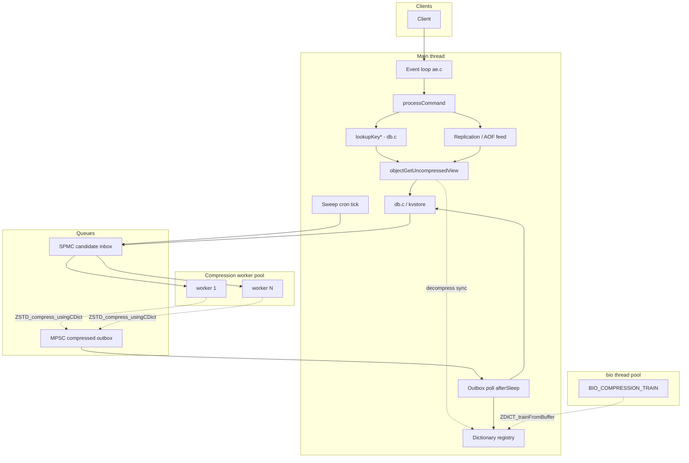
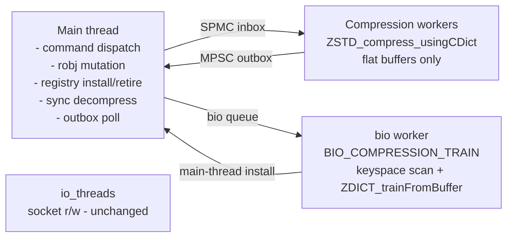

# Detailed Design — Real-time In-memory Value Compression for Valkey

_Status: proposed, v1_
_Scope: `OBJ_STRING` values only_
_Source issue: [valkey-io/valkey #3423](https://github.com/valkey-io/valkey/issues/3423)_

---

## Table of contents

1. [Overview](#1-overview)
2. [Detailed requirements](#2-detailed-requirements)
3. [Architecture overview](#3-architecture-overview)
4. [Components and interfaces](#4-components-and-interfaces)
5. [Data models](#5-data-models)
6. [Error handling](#6-error-handling)
7. [Testing strategy](#7-testing-strategy)
8. [Appendix A — Technology choices](#appendix-a--technology-choices)
9. [Appendix B — Research findings summary](#appendix-b--research-findings-summary)
10. [Appendix C — Alternative approaches considered](#appendix-c--alternative-approaches-considered)
11. [Appendix D — Explicit v1 non-goals and v2 roadmap](#appendix-d--explicit-v1-non-goals-and-v2-roadmap)

---

## 1. Overview

### 1.1 What this feature does

Valkey keeps values in memory as SDS strings. For workloads dominated by `OBJ_STRING` values of moderate size (256 B – 1 MiB) with repetitive content (JSON blobs, URL-keyed DTOs, HTML fragments, serialized protocol buffers, etc.), a large fraction of the memory footprint is compressible. Internal fleet analysis on AWS ElastiCache shows ≥50% memory savings are achievable on 92% of memory-bound production snapshots using ZSTD with a trained dictionary.

This feature adds **opt-in, transparent, server-side, in-memory compression** for `OBJ_STRING` values. Compressed values are automatically decompressed on any read path (client commands, scripts, transactions, replication, AOF, modules), so no client or operational tooling changes are required. The feature is disabled by default; enabled, it is fully observable via `INFO`, controllable via `CONFIG SET compression-*` and a new `COMPRESSION` subcommand container, and bounded in both CPU and memory overhead.

### 1.2 Headline scope statement

> v1 ships compression for `OBJ_STRING` values only, with synchronous decompression on the main thread, one active dictionary per server, self-trained by a keyspace-scan job on `bio`, with explicit operator controls (`COMPRESSION` subcommands + `compression-*` configs). All other value types, async decompression, adaptive behaviors, and cluster-level dictionary coordination are explicit v2 scope.

### 1.3 Goals

- **Reduce memory** by ≥30% on target workloads (POC baseline) at production-safe CPU cost (<20% TPS degradation).
- **Transparent** to clients, scripts, transactions, replication, AOF, and modules — no wire or semantic changes.
- **Opt-in**, with a single master switch (`compression-enabled`) and zero fixed cost when disabled.
- **Observable** — memory saved, compression ratio, training events, dict lifecycle, and errors exposed via `INFO`, logs, and latency monitor.
- **Bounded blast radius** — the feature is encapsulated in a small number of files; existing code paths are touched only through well-defined helpers.
- **Extensible** — the encoding-tag design structurally supports future value types and async decompression without breaking changes.

### 1.4 Non-goals (v1)

See [Appendix D](#appendix-d--explicit-v1-non-goals-and-v2-roadmap). Key exclusions: non-string data types; async decompression; decompressed-view cache; adaptive kill-switch; compressed-in-place MIGRATE; cluster-wide dictionary gossip; advanced trainer tuning; module-provided compression backends.

---

## 2. Detailed requirements

Requirements are consolidated from `idea-honing.md`. Each bullet is traceable to a Q1–Q16 discussion.

### 2.1 Master switch and operator surface

- **R2.1.1** The feature is gated by a master switch `compression-enabled` (bool, default `no`, `MODIFIABLE_CONFIG`). When `no`, no compression CPU is spent and no worker threads run. (Q5)
- **R2.1.2** Two surfaces toggle the switch: `CONFIG SET compression-enabled yes|no` (primary) and `COMPRESSION ENABLE`/`COMPRESSION DISABLE` (convenience alias, writes a `LL_NOTICE` log entry for audit trails). (Q5)
- **R2.1.3** `no → yes` transition: background sweeper starts on the next cron tick; values are compressed opportunistically by new writes and by the sweeper. `COMPRESSION SWEEP` triggers immediate sweep. (Q5)
- **R2.1.4** `yes → no` transition: new writes stop being compressed; existing compressed values continue to be decompressed on read; the dictionary registry stays alive. No automatic keyspace decompress. Operator explicitly runs `COMPRESSION SWEEP direction=decompress` to drop all compressed frames and the dictionary registry. Peak memory is never doubled automatically. (Q5)
- **R2.1.5** A third state — "`compression-enabled yes` but no active dictionary yet" — behaves identically to disabled for new writes. Decompression of any existing frames still works. Documented as expected behavior. (Q5)

### 2.2 Value eligibility

The compression sweeper considers a value eligible iff the predicate holds:

```
eligible(obj) ⇔
    obj->type == OBJ_STRING
 && obj->encoding ∈ {RAW, EMBSTR}
 && obj->refcount != OBJ_SHARED_REFCOUNT
 && sdslen(val) >= compression-min-value-size
 && (compression-max-value-size == 0 || sdslen(val) <= compression-max-value-size)
 && last_retry_failure_age(obj) >= compression-retry-interval
 && (
        (lfu_mode  && lfu_freq(obj)   <  compression-lfu-threshold)   ||
        (lru_mode  && lru_idle(obj)   >= compression-lru-idle-seconds) ||
        (other     && write_age(obj)  >= compression-settle-seconds)
    )
```
(Q6, Q7)

**Post-compression net-savings guard** runs on the main thread after the worker returns:

```
compressed_size + header_size >= uncompressed_size * (1 - compression-min-savings-ratio)
  → discard compressed form, mark key with retry cooldown, increment
    compression_skipped_incompressible.
```
(Q6)

### 2.3 Dictionary lifecycle

- **R2.3.1** The server maintains a **dictionary registry**: a small set of `{dictID, raw_bytes, ZSTD_CDict*, ZSTD_DDict*, refcount, state}` entries. State ∈ `{active, retiring, retired}`. (Q1)
- **R2.3.2** At most **one** dictionary is `active` at any time (the one used to compress new values). Zero-or-more are `retiring` (decompress-only for older frames). (Q1)
- **R2.3.3** The registry is capped at `compression-dict-max-versions` entries (int, default `4`, min `2`, `MODIFIABLE_CONFIG`). When full, retraining/promotion is blocked, a `LL_WARNING` log entry is emitted, and `compression_dict_cap_reached` is set to `1` in `INFO`. Operator unblocks by running `COMPRESSION SWEEP` to retire the oldest dict, or by raising the cap. (Q1)
- **R2.3.4** A dict's refcount tracks the number of compressed frames that reference its dictID. When refcount hits zero, the dict transitions to `retired` and its CDict/DDict/raw_bytes are freed. (Q1)
- **R2.3.5** **Training triggers** (Q9):
  - **First training**: fires when the eligible-keys write counter reaches `compression-dict-first-training-keys-count` (default `10000`).
  - **Drift-based steady-state retraining**: fires when `compression_live_ratio_10m < compression-dict-drift-ratio × post_training_ratio` (default drift ratio `70%`).
  - **Optional time-based retraining**: `compression-dict-refresh-interval` (default `0` = disabled).
  - **Manual**: `COMPRESSION TRAIN` forces an immediate training job.
- **R2.3.6** **Training sampling**: the training job walks kvstore shards in random order on a `bio` worker, collects sample pointers into value sds bodies via `incrRefCount`, passes them directly to `ZDICT_trainFromBuffer`, and `decrRefCount`s after training. No reservoir buffer; zero sustained memory overhead. Scan uses `LOOKUP_NOTOUCH` semantics — training reads do not update LRU/LFU. (Q9)
- **R2.3.7** **Training location**: a new `bio` job type `BIO_COMPRESSION_TRAIN`. Fits the `bio` model (long-running, infrequent, one-at-a-time). Does not occupy a compression worker. (Q9)
- **R2.3.8** **Training algorithm**: `ZDICT_trainFromBuffer` with target size `compression-dict-size` (default `102400` bytes). Advanced tuning is v2. (Q9)
- **R2.3.9** **Promotion**: after training, the main thread creates `ZSTD_CDict` and `ZSTD_DDict` from the new bytes, inserts into the registry with a fresh dictID, atomically swaps the `active` pointer, and transitions the previous active to `retiring`. (Q1, Q9)
- **R2.3.10** **Preshared dictionary**: `COMPRESSION DICT IMPORT <base64-bytes>` installs as a new registry entry, going through the same promotion path as a trained dictionary. `COMPRESSION DICT EXPORT <dictID>` returns raw dictionary bytes (base64). Both require `@admin` ACL. (Q2)

### 2.4 Compression path

- **R2.4.1** Eligible values are enqueued on a **candidate queue** (SPMC) by write paths (`dbAdd`, `dbOverwrite`) when the eligibility predicate holds at write time, and by the **background sweeper** during its cron tick. (Q6, Q8)
- **R2.4.2** Compression workers (separate pool from `io-threads`) dequeue from the candidate queue, call `ZSTD_compress_usingCDict` on the flat value bytes, and post the result to an outbox (MPSC). Workers **never touch `robj`**. (Q8)
- **R2.4.3** The main thread polls the outbox on `afterSleep`/cron, runs the post-compression net-savings guard (R2.2 second block), and if accepted:
  - Allocates the compressed buffer (header + ZSTD frame).
  - `zfree`s the old uncompressed sds; `zmalloc`s the new buffer. `used_memory` accounting is correct automatically (Q14).
  - Mutates `robj->val_ptr` to the new buffer, sets `encoding = OBJ_ENCODING_COMPRESSED`.
  - Increments the dictID refcount.
  - Does **not** call `signalModifiedKey`. Background compression is a storage change, not a logical value change. (Q11)

### 2.5 Decompression path

- **R2.5.1** All decompression is **synchronous on the main thread** in v1. No worker-side decompression path exists. (Q7)
- **R2.5.2** A single helper function `robj *objectGetUncompressedView(robj *o, sds *scratch)` is the **only** entry point for getting uncompressed bytes from a value:
  - If `o->encoding != OBJ_ENCODING_COMPRESSED`: returns `o` unchanged. Zero cost.
  - Otherwise: looks up the dictID in the registry, calls `ZSTD_decompress_usingDDict` into the caller-provided scratch sds, and returns a temporary view `robj` (or equivalent) pointing at the scratch buffer.
- **R2.5.3** The helper **must not** call `signalModifiedKey`. (Q11)
- **R2.5.4** `compression-max-value-size` (default `1048576` bytes = 1 MiB, `0` = no bound) excludes pathologically large values from compression so their decompression cost can never stall the main thread. (Q7)
- **R2.5.5** Large-value workloads that need non-blocking reads are directed to either (a) raise `compression-min-value-size` or lower `compression-max-value-size` to opt them out, or (b) wait for v2 async decompression. (Q7)

### 2.6 Persistence

- **R2.6.1** **RDB on-disk format** (Q12, research `persistence-and-replication.md`):
  - New string encoding marker `RDB_ENC_ZSTDDICT` (value `4`).
  - Layout per compressed value: `[RDB_ENCVAL | dictID (len-encoded) | compressed_len (len-encoded) | uncompressed_len (len-encoded) | ZSTD frame bytes]`.
  - Dictionary bytes are written as `RDB_OPCODE_AUX` entries (key `"compression-dict-<N>"`, value = raw bytes) **before** any compressed value that references them.
  - `RDB_VERSION` is bumped (`80 → 81`). Pre-feature loaders will refuse the file cleanly.
- **R2.6.2** **RDB load when `compression-enabled yes`**: loader rebuilds CDict/DDict from AUX entries, inserts them into the registry, decompresses values on the fly only if needed (frames reference their dictID so they stay compressed in memory). (Q3, Q12)
- **R2.6.3** **RDB load when `compression-enabled no`**: loader rebuilds only the DDicts needed, decompresses every `RDB_ENC_ZSTDDICT`-marked value inline, stores uncompressed, discards DDicts after load. (Q3)
- **R2.6.4** **Missing dictionary**: if a compressed value references a dictID for which no AUX entry was emitted, the RDB is rejected as corrupt regardless of the `compression-enabled` setting. (Q3)
- **R2.6.5** **AOF**: always uncompressed RESP. Writer routes every `robj` through `objectGetUncompressedView` before emitting. (Q12)
- **R2.6.6** **Replication feed**: always uncompressed RESP. `feedReplicationBufferWithObject` routes through `objectGetUncompressedView`. Cross-version replication unaffected. (Q12)
- **R2.6.7** **`DUMP` / `RESTORE` / `MIGRATE`**: v1 decompresses before emitting the RDB chunk. Compressed-in-place migration is v2. (Q12)

### 2.7 Introspection surfaces

- **R2.7.1** **`OBJECT ENCODING key`** returns `compressed` for compressed values. New encoding name documented. (Q13)
- **R2.7.2** **`DEBUG OBJECT key`** extends its debug line with `dictID:<N> compressedlength:<N> uncompressedlength:<N>` when the value is compressed. (Q13)
- **R2.7.3** **`MEMORY USAGE key`** returns compressed footprint (frame + header + `robj` overhead). Matches what eviction and `maxmemory` actually see. (Q13, Q14)
- **R2.7.4** **`TYPE`**, **`OBJECT FREQ`**, **`OBJECT IDLETIME`**: unchanged. (Q13)
- **R2.7.5** **Module API** (`ValkeyModule_StringDMA` read intent, `ValkeyModule_OpenKey`): decompresses transparently via `objectGetUncompressedView`. Existing modules need no changes. (Q13)
- **R2.7.6** **Module API** (`ValkeyModule_StringDMA` write intent on a compressed value): decompresses in place first (mutates `robj` to `raw`/`embstr`, frees the compressed frame), then returns the sds pointer. The value becomes eligible for re-compression on the next sweep tick. (Q13)

### 2.8 Memory accounting

- **R2.8.1** Eviction sampler, `MEMORY USAGE`, and `INFO memory` use the compressed footprint for compressed values, via standard `zmalloc_size` / `used_memory` accounting. No custom accounting layer is introduced. (Q14)
- **R2.8.2** Fixed overhead (CCtx/DCtx, digested dicts in the registry, candidate queue) is allocated via `zmalloc` → counted in `used_memory`. `INFO compression` additionally reports it under `compression_net_saved_bytes`. (Q14)
- **R2.8.3** `MEMORY STATS` sub-aggregate for compression is v2. (Q14)

### 2.9 Scripting and transactions

- **R2.9.1** **Rule 1 — sync-mandatory**: decompression MUST run synchronously on the main thread inside `EVAL`/`EVALSHA`/`FCALL`/`FCALL_RO`, inside queued `MULTI`/`EXEC` transactions, on the replication feed, and on the AOF writer. v1's always-sync model satisfies this automatically. Rule remains as a forward-compatibility constraint for v2. (Q11)
- **R2.9.2** **Rule 2 — no `signalModifiedKey`**: background compression and in-place decompression **must not** call `signalModifiedKey`. This is enforced via the single-entry-point helper (R2.5.2) plus code comments plus tests. (Q11)

### 2.10 Observability

- **R2.10.1** New `INFO compression` section with the following fields (see §5.6):
  `compression_enabled`, `compression_state`, `compression_active_dict_id`, `compression_dict_age_seconds`, `compression_known_dicts`, `compression_dict_cap_reached`, `compression_compressed_objects`, `compression_total_uncompressed_bytes`, `compression_total_compressed_bytes`, `compression_ratio`, `compression_live_ratio_10m`, `compression_net_saved_bytes`, `compression_candidates_pending`, `compression_compressions_per_sec`, `compression_decompressions_per_sec`, `compression_skipped_incompressible`, `compression_training_last_duration_ms`, `compression_training_last_sample_count`, `compression_errors_total`. (Q10)
- **R2.10.2** Latency-monitor events `compress-sync`, `decompress-sync`, `compression-train` use the existing `latency-monitor-threshold` floor. No new config. (Q10)
- **R2.10.3** **No keyspace notifications** for compression events. Operator audit trail is provided by server log entries at `LL_NOTICE` (normal transitions) and `LL_WARNING` (training failures, cap reached). (Q10)

### 2.11 CPU and concurrency

- **R2.11.1** Dedicated compression worker pool, sized by `compression-threads` (int, default `1`, range `0..16`, `MODIFIABLE_CONFIG`). `0` = disabled (feature becomes no-op). Separate from `io-threads`. (Q8)
- **R2.11.2** Sweep pacing: `compression-sweep-max-cpu-pct` (int, default `25`, range `1..100`, `MODIFIABLE_CONFIG`). Applied only to background sweep batches; training and multi-key compression are naturally arrival-bounded. (Q8)
- **R2.11.3** CPU pinning: `compression_cpulist` (string, default empty). Follows the existing `bio_cpulist` / `aof_rewrite_cpulist` precedent. (Q8)
- **R2.11.4** Compression workers never touch `robj`. They consume and produce flat byte buffers. The main thread owns all `robj` mutation. (Q8)

### 2.12 Configuration summary

All configs below are `MODIFIABLE_CONFIG` and persist via `CONFIG REWRITE`.

| Name | Type | Default | Scope |
|---|---|---|---|
| `compression-enabled` | bool | `no` | master switch |
| `compression-threads` | int | `1` | worker pool size (0..16; 0 = disabled) |
| `compression-sweep-max-cpu-pct` | int | `25` | sweep pacing (1..100) |
| `compression_cpulist` | string | `""` | CPU pinning |
| `compression-min-value-size` | bytes | `256` | lower size bound for eligibility |
| `compression-max-value-size` | bytes | `1048576` | upper size bound (0 = unbounded) |
| `compression-min-savings-ratio` | percent | `10` | post-compression net-savings guard |
| `compression-retry-interval` | seconds | `3600` | cooldown for incompressible keys |
| `compression-lfu-threshold` | int | `5` | LFU skip-hot-key threshold |
| `compression-lru-idle-seconds` | seconds | `60` | LRU skip-fresh-key threshold |
| `compression-settle-seconds` | seconds | `60` | write-age threshold (noeviction/other) |
| `compression-dict-size` | bytes | `102400` | zstd trainer target dict size |
| `compression-dict-first-training-keys-count` | int | `10000` | first-training trigger |
| `compression-dict-drift-ratio` | percent | `70` | retrain drift trigger |
| `compression-dict-refresh-interval` | seconds | `0` | optional periodic retrain (0 = disabled) |
| `compression-dict-max-versions` | int | `4` | registry cap (min 2) |

---

## 3. Architecture overview

### 3.1 High-level view



### 3.2 Hot-path seams

All feature integration happens at a small, well-defined set of seams:

- **Read path** (`lookupKey*` in `src/db.c`): every type-command handler already funnels through this. Handlers that read value bytes (`getCommand`, `appendCommand`, etc.) call `objectGetUncompressedView` to get a decompressed view.
- **Write path** (`dbAddInternal`, `dbSetValue`, `dbOverwrite` in `src/db.c`): on insert/overwrite, check eligibility and enqueue on the candidate inbox. Compression itself happens later, off-thread.
- **Replication feed** (`feedReplicationBufferWithObject` in `src/replication.c`): routes through `objectGetUncompressedView`.
- **AOF writer**: routes through `objectGetUncompressedView`.
- **RDB writer/reader** (`src/rdb.c`): new encoding marker `RDB_ENC_ZSTDDICT` + AUX entries for dicts.
- **Cron** (`serverCron` in `src/server.c`): sweep tick enqueues candidates; dict age / drift is evaluated.
- **`afterSleep` hook**: polls the MPSC outbox and installs compressed frames.

### 3.3 Threading model



Separation invariants:
- The worker pool is independent of `io-threads`. They are sized and scheduled separately.
- Workers never touch `robj`. Main thread owns all `robj` mutation.
- `bio` is reused for training (one-at-a-time, long-running); not for per-value compression.
- Synchronous decompression runs on the main thread directly; no offload.

---

## 4. Components and interfaces

All new source files live under `src/`. Every `.c` is registered in **both** `src/Makefile` (in the appropriate `ENGINE_*_OBJ` list) and `src/CMakeLists.txt` per the repo convention.

### 4.1 New source files

| File | Role |
|---|---|
| `src/compression.c` / `compression.h` | Public entry points: `compressionInit`, `compressionCron`, `compressionToggle`, `objectGetUncompressedView`, `compressionIsEligible`, `compressionEnqueueCandidate`, `compressionAfterSleep`, `infoCompression`. |
| `src/compression_registry.c` | Dictionary registry: add / lookup-by-dictID / promote / retire, refcounting, cap enforcement. |
| `src/compression_workers.c` | Worker pool: thread startup/shutdown, SPMC inbox, MPSC outbox, sweep pacing. |
| `src/compression_train.c` | Training: keyspace-scan sample collector, `ZDICT_trainFromBuffer` invocation (called by `bio`). |
| `src/compression_header.c` | Per-value header encode/decode, `OBJ_ENCODING_COMPRESSED` allocation / free helpers. |
| `src/commands/compression-*.json` | Subcommand JSON metadata for `COMPRESSION *` (see §4.5). |

### 4.2 Touched existing files

| File | Change |
|---|---|
| `src/server.h` | New encoding constant `OBJ_ENCODING_COMPRESSED`; global `compressionState` struct; forward declarations. |
| `src/server.c` | Call `compressionInit` at startup; wire `compressionCron` into `serverCron`; wire `compressionAfterSleep` into the event-loop `afterSleep` hook; add `infoCompression` to `genValkeyInfoString`. |
| `src/object.c` | `createCompressedObject`; `freeStringObject` frees compressed buffers correctly; `OBJECT ENCODING` returns `"compressed"`. |
| `src/config.c` | Register `compression-*` configs; register `compression_cpulist`. |
| `src/db.c` | `lookupKey*` does not call the decompression helper itself — that is done by the type-command handlers. `dbAddInternal`, `dbSetValue`, `dbOverwrite` call `compressionEnqueueCandidate(obj)` after the new value is installed. |
| `src/t_string.c` | `getCommand`, `appendCommand`, `strlenCommand`, `getrangeCommand`, `setrangeCommand` etc. route through `objectGetUncompressedView` for reads and decompress-in-place for writes on compressed values. |
| `src/replication.c` | `feedReplicationBufferWithObject` routes through `objectGetUncompressedView`. |
| `src/aof.c` | `feedAppendOnlyFile` path routes through `objectGetUncompressedView`. |
| `src/rdb.c` | `RDB_ENC_ZSTDDICT` encode/decode; AUX emission/load for dictionary bytes; bump `RDB_VERSION` to `81`. |
| `src/rdb.h` | `#define RDB_ENC_ZSTDDICT 4`; bump `RDB_VERSION`. |
| `src/debug.c` | `DEBUG OBJECT` prints `dictID`, `compressedlength`, `uncompressedlength` for compressed values. |
| `src/evict.c` | No change — `zmalloc_size`-based accounting handles compressed robjs automatically. |
| `src/module.c` | `RM_StringDMA` (read): transparently returns decompressed view. `RM_StringDMA` (write) on compressed value: decompress in place first. |
| `src/bio.h`, `src/bio.c` | New job type `BIO_COMPRESSION_TRAIN`, new worker slot in `bio_job_to_worker`. |

### 4.3 Public internal API — `compression.h`

```c
/* Lifecycle */
void compressionInit(void);
void compressionCron(void);             /* called from serverCron */
void compressionAfterSleep(void);       /* called from event-loop afterSleep */

/* Toggle */
void compressionToggle(int enabled);    /* config hook */

/* Read path (hot) */
robj *objectGetUncompressedView(robj *o, sds *scratch);

/* Write path (main thread) */
int  compressionIsEligible(robj *o);
void compressionEnqueueCandidate(robj *o, robj *key, int dbid);

/* Operator surface (COMPRESSION subcommands call these) */
int  compressionForceTrain(client *c);
int  compressionSweep(client *c, int direction /* compress|decompress */);
int  compressionDictList(client *c);
int  compressionDictExport(client *c, uint32_t dictID);
int  compressionDictImport(client *c, const unsigned char *bytes, size_t len);
int  compressionDictDrop(client *c, uint32_t dictID);
int  compressionStatus(client *c);

/* INFO */
void infoCompression(sds info);
```

### 4.4 Dictionary registry — `compression_registry.c`

```c
typedef enum { DICT_STATE_ACTIVE, DICT_STATE_RETIRING, DICT_STATE_RETIRED } compressionDictState;

typedef struct compressionDict {
    uint32_t        dictID;
    unsigned char  *bytes;          /* raw training output or imported bytes */
    size_t          bytes_len;
    ZSTD_CDict     *cdict;          /* NULL for retiring dicts (decompress-only) */
    ZSTD_DDict     *ddict;
    size_t          refcount;       /* number of compressed frames referencing this dictID */
    compressionDictState state;
    mstime_t        promoted_at_ms;
} compressionDict;

typedef struct compressionRegistry {
    compressionDict *dicts[COMPRESSION_DICT_MAX];  /* sized by compression-dict-max-versions */
    int              n_dicts;
    compressionDict *active;        /* active pointer; atomic read/swap */
    /* counters, error totals, etc. */
} compressionRegistry;
```

The registry is **single-writer (main thread)**. Reads can happen from workers (for digested dicts) and the main thread (for decompression). Readers atomically load `active` or look up by dictID; they hold a pointer for the duration of a single compress/decompress call, then release it. Retirement waits until `refcount == 0`; this is guaranteed to happen eventually as old frames are rewritten/expired, or forced via `COMPRESSION SWEEP`.

### 4.5 `COMPRESSION` subcommand container

| Subcommand | Summary | ACL |
|---|---|---|
| `COMPRESSION ENABLE` | Set `compression-enabled yes`; log `LL_NOTICE`. | `@admin` |
| `COMPRESSION DISABLE` | Set `compression-enabled no`; log `LL_NOTICE`. | `@admin` |
| `COMPRESSION TRAIN` | Submit an immediate `BIO_COMPRESSION_TRAIN` job. | `@admin` |
| `COMPRESSION SWEEP [direction=compress|decompress]` | Trigger a full-keyspace sweep. | `@admin` |
| `COMPRESSION STATUS` | Returns the `INFO compression` section as a flat structured reply. | `@read` |
| `COMPRESSION DICT LIST` | Returns an array per registry entry: `{dictID, state, age_ms, refcount, bytes_len}`. | `@admin` |
| `COMPRESSION DICT EXPORT <dictID>` | Returns base64-encoded dictionary bytes. | `@admin` |
| `COMPRESSION DICT IMPORT <base64-bytes>` | Installs as a new dict; atomic promotion. | `@admin` |
| `COMPRESSION DICT DROP <dictID>` | Force-retires a dict. Fails if `refcount > 0`. | `@admin` |
| `COMPRESSION HELP` | Subcommand listing. | `@read` |

Each subcommand has a JSON file under `src/commands/compression-*.json` with arity, flags, reply schema. `utils/generate-command-code.py` regenerates `src/commands.def`.

### 4.6 Queue primitives

Reuse the existing queue primitives from `src/queues.h`:
- **`spmcQueue`** — main thread (producer) enqueues candidates; N workers dequeue. Matches `io_threads` shared inbox shape.
- **`mpscQueue`** — N workers produce compressed results; main thread consumes. Matches `io_threads` outbox shape.

Job structure:

```c
typedef struct compressionJob {
    robj         *key;         /* key name, used to resolve robj later */
    int           dbid;
    uint64_t      version;     /* robj version counter; detects concurrent rewrites */
    unsigned char *src;        /* pointer into value sds at enqueue time (held via incrRefCount) */
    size_t        src_len;
    uint32_t      dictID;      /* snapshot of active dictID at enqueue */
    /* filled by worker: */
    unsigned char *dst;        /* compressed bytes */
    size_t         dst_len;
    int            err;        /* 0 = ok, else ZSTD error */
} compressionJob;
```

**Concurrency notes**:
- Enqueue holds `incrRefCount(val)` so the sds pointer stays valid for the worker.
- On the outbox side, the main thread re-fetches the current `robj` for the key; if it has changed (version counter moved), the compressed result is discarded.
- `decrRefCount(val)` is called after the outbox handler finishes.

---

## 5. Data models

### 5.1 `robj` encoding tag

A new value in the `OBJ_ENCODING_*` enum (4-bit field in `robj`, room available):

```c
#define OBJ_ENCODING_COMPRESSED 12   /* value = pointer to compressedBuffer */
```

Layout for a compressed `robj`:

```
robj { type=OBJ_STRING, encoding=OBJ_ENCODING_COMPRESSED, hasembval=0, val_ptr → compressedBuffer }
```

### 5.2 Per-value compressed buffer

```
+-----------------------+------------------+
| compressedHeader      | ZSTD frame bytes |
|   (16 bytes total)    |                  |
+-----------------------+------------------+

compressedHeader {
    uint32_t magic;          /* 0x5A 0x44 0x49 0x43 = "ZDIC" - sanity check */
    uint32_t dictID;         /* references a registry entry */
    uint32_t uncompressed_len;
    uint32_t compressed_len; /* total frame bytes, excluding header */
}
```

Total on-heap footprint per value = `sizeof(compressedHeader) + compressed_len + robj overhead`. `zmalloc_size` reports this automatically.

### 5.3 RDB encoding

`RDB_ENC_ZSTDDICT = 4` (new). When the writer emits a compressed string it writes:

```
[ 0xC0 | RDB_ENC_ZSTDDICT ]        // one byte (RDB_ENCVAL | encoding)
[ len-encoded dictID ]
[ len-encoded compressed_len ]
[ len-encoded uncompressed_len ]
[ compressed_len bytes of ZSTD frame ]
```

Dictionary bytes are emitted as `RDB_OPCODE_AUX` entries (key = `"compression-dict-<dictID>"`, value = raw dictionary bytes). **AUX entries for a dict MUST be written before any compressed value referencing it.**

`RDB_VERSION` bumps `80 → 81`. Older loaders refuse the file (`rdb.c` already rejects unknown string encoding markers); new loaders accept both old and new files.

### 5.4 Global state

```c
typedef struct compressionState {
    int                  enabled;
    int                  state;             /* idle | training | active | disabled */
    compressionRegistry *registry;
    spmcQueue           *inbox;             /* candidates */
    mpscQueue           *outbox;            /* compressed results */
    pthread_t           *worker_tids;
    int                  n_workers;
    /* counters (updated on main thread only; workers post deltas via outbox) */
    uint64_t             compressed_objects;
    uint64_t             total_uncompressed_bytes;
    uint64_t             total_compressed_bytes;
    uint64_t             skipped_incompressible;
    uint64_t             errors_total;
    /* rolling EMAs */
    double               live_ratio_10m;
    double               compressions_per_sec;
    double               decompressions_per_sec;
    /* training state */
    mstime_t             last_training_duration_ms;
    size_t               last_training_sample_count;
    /* sweep state */
    int                  sweep_in_progress;
    int                  sweep_direction;
    size_t               sweep_shard_cursor;
    /* write-path counter for first-training trigger */
    uint64_t             eligible_keys_written;
} compressionState;

extern compressionState server_compression;
```

### 5.5 Candidate queue entry

See §4.6 `compressionJob`.

### 5.6 `INFO compression` field specification

| Field | Source |
|---|---|
| `compression_enabled` | `server_compression.enabled` |
| `compression_state` | `server_compression.state` |
| `compression_active_dict_id` | `registry->active->dictID` or `0` |
| `compression_dict_age_seconds` | `(now - registry->active->promoted_at_ms) / 1000` |
| `compression_known_dicts` | `registry->n_dicts` |
| `compression_dict_cap_reached` | set when promotion was blocked; cleared on successful promotion or cap raise |
| `compression_compressed_objects` | `server_compression.compressed_objects` |
| `compression_total_uncompressed_bytes` | accumulator |
| `compression_total_compressed_bytes` | accumulator (includes headers; excludes fixed overhead) |
| `compression_ratio` | `total_compressed / total_uncompressed` |
| `compression_live_ratio_10m` | EMA, 10-minute window |
| `compression_net_saved_bytes` | `total_uncompressed - total_compressed - fixed_overhead_bytes` |
| `compression_candidates_pending` | queue depth (worker inbox) |
| `compression_compressions_per_sec` | EMA, 1-second window |
| `compression_decompressions_per_sec` | EMA, 1-second window |
| `compression_skipped_incompressible` | counter |
| `compression_training_last_duration_ms` | last value |
| `compression_training_last_sample_count` | last value |
| `compression_errors_total` | counter |

---

## 6. Error handling

### 6.1 Compression errors (worker path)

- `ZSTD_compress_usingCDict` returns an error size: worker posts the job with `err` set; main thread increments `compression_errors_total`, drops the result, leaves the value uncompressed, logs `LL_WARNING` at first error per minute (rate-limited).
- Worker allocation failure (`zmalloc` OOM for compressed buffer): same path as above.

### 6.2 Decompression errors (read path)

- `ZSTD_decompress_usingDDict` failure on read is a **data corruption event**. The server logs `LL_WARNING`, increments `compression_errors_total`, returns a `-ERR compressed value corrupt` reply to the client, and does not crash. Running `DEBUG DIGEST-VALUE` against the key post-facto aids diagnosis.
- Dictionary lookup miss (frame references a dictID not in the registry): treated as above. Should never happen in a healthy server because retirement only fires at refcount == 0.

### 6.3 Training errors

- Insufficient samples (fewer than `compression-dict-first-training-keys-count` eligible values in the keyspace): `BIO_COMPRESSION_TRAIN` aborts, logs `LL_WARNING`, schedules a retry on the next trigger.
- `ZDICT_trainFromBuffer` error: abort, log `LL_WARNING`, increment `compression_errors_total`, do not promote.

### 6.4 Dict cap reached

- Attempted promotion when `n_dicts == compression-dict-max-versions`: promotion refused, `compression_dict_cap_reached = 1`, log `LL_WARNING`. Continues serving existing compressed values; simply doesn't retrain. Cleared on next successful promotion.

### 6.5 RDB integrity

- `RDB_ENC_ZSTDDICT` value with missing dictionary AUX → RDB rejected as corrupt. `valkey-check-rdb` reports which dictID is missing.
- Header magic mismatch on in-memory compressed value → logged `LL_WARNING`, treated as corruption (R6.2 path).

### 6.6 Net-savings guard failure

- Post-compression check determines the compressed form is not worth keeping: discard the compressed buffer, leave the value as-is, stamp the key with `retry_after = now + compression-retry-interval`, increment `compression_skipped_incompressible`. Not an error — normal operation for incompressible data.

### 6.7 Worker thread crash

- A compression worker crashing takes the server down today (any thread crash in Valkey does). Workers execute a very small code surface (`ZSTD_compress_usingCDict` + memcpy); assertion failures would be in our code, not zstd's.

---

## 7. Testing strategy

Two tiers, per Q15.

### 7.1 Tier 1 — transparency mode

A new `--compression` flag on each Tcl test driver starts the server under test with an aggressive compression config that forces every eligible value through the compression path:

```
--compression-enabled yes
--compression-min-value-size 0
--compression-max-value-size 0            # no upper bound
--compression-lfu-threshold 255
--compression-lru-idle-seconds 0
--compression-settle-seconds 0
--compression-min-savings-ratio 0
--compression-retry-interval 0
--compression-dict-first-training-keys-count 10
--compression-threads 1
--compression-sweep-max-cpu-pct 100
```

Deliverables:
- `--compression` on `runtest`, `runtest-cluster`, `runtest-sentinel`, `runtest-moduleapi`.
- `make test-compression`, `make test-cluster-compression`, `make test-sentinel-compression`, `make test-moduleapi-compression`.
- New test tag `compression:skip` for the ≤~20 tests that legitimately assert on exact `OBJECT ENCODING`, exact `MEMORY USAGE`, or exact `DEBUG OBJECT` output.
- Test-author guidance added to `tests/README.md`.
- Helper `assert_string_encoding $key $expected_set` that accepts `compressed` alongside `raw`/`embstr`.
- CI: `.github/workflows/ci.yml` gains a `compression=on` matrix cell per suite.

### 7.2 Tier 2 — feature-specific tests

**Tcl tests** (under `tests/`):

- `tests/unit/compression.tcl` — core feature (toggle, sweep, eligibility, size bounds, post-compression guard, retry cooldown, per-key introspection).
- `tests/unit/compression-dict.tcl` — `COMPRESSION TRAIN`, `DICT LIST/EXPORT/IMPORT/DROP`, drift detection, dict-version cap.
- `tests/unit/compression-multi.tcl` — Q11 invariants (`WATCH` + background compression → `EXEC` does not abort; `CLIENT TRACKING` → no spurious invalidations; `EVAL` / `EXEC` semantics).
- `tests/unit/compression-persistence.tcl` — RDB save/load with active+retiring dicts; load with `compression-enabled no`; missing dict AUX rejection; AOF stays uncompressed; cross-version replication.
- `tests/integration/compression-replication.tcl` — primary compresses, replica does not; toggle on primary does not disrupt stream.
- `tests/unit/cluster/compression-migrate.tcl` — `MIGRATE` decompresses on source.
- `tests/unit/compression-transparency.tcl` — canary meta-test for a handful of commands.

**C++ gtest units** (under `src/unit/`):

- `src/unit/test_compression_registry.cpp` — add/lookup/promote/retire; refcount; cap enforcement.
- `src/unit/test_compression_eligibility.cpp` — every branch of the R2.2 predicate.
- `src/unit/test_compression_header.cpp` — encode/decode round-trips; malformed-header rejection.
- `src/unit/test_compression_sweep_pacing.cpp` — pacing math.

**Module API test** (under `tests/modules/`):

- `tests/modules/compression.c` — DMA (read/write) and `OpenKey` transparency on compressed keys.

### 7.3 Performance regression

One scenario added to the existing benchmark workflows:
- Workload: 80/20 GET/SET, 1 KiB values, warm cache.
- Compared: `compression-enabled no` vs. `yes` (default production config).
- Expected: ~30% lower `used_memory`; ≤20% TPS degradation.
- Status: **informational**, not a merge gate.

### 7.4 Reply-schema and formatting

- JSON reply schemas for all `COMPRESSION *` commands under `src/commands/`, validated by `.github/workflows/reply-schemas-linter.yml`.
- `clang-format-18` on all new sources.
- `.config/typos.toml` clean.

---

## Appendix A — Technology choices

### A.1 ZSTD with trained dictionary (chosen)

Reasons:
- Best-in-class compression ratio for small buffers (256 B – 8 KB) when a dictionary is available. POC confirmed ≥50% savings on 92% of fleet snapshots.
- Mature, widely deployed, stable API. Dictionary support is first-class (`ZSTD_CDict` / `ZSTD_DDict`, dictID in frame header, multi-DDict decoder).
- Thread-safe `CDict`/`DDict` (immutable after creation) simplifies our publish-once-read-many model.
- Linked as a vendored dependency, no new system library requirement.

### A.2 LZ4 (rejected)

- Pro: lower CPU.
- Con: poor compression ratio on small buffers without a dictionary. The fleet analysis specifically established that LZ4 cannot hit the ≥50% savings goal.

### A.3 LZF (rejected)

- Pro: already in Valkey for RDB.
- Con: same small-buffer ratio problem as LZ4; no dictionary support.

### A.4 Hardware compression (deferred)

- Graviton2/Nitro, QAT offer further CPU reductions.
- Deferred to v2+; feature is designed so the algorithm can be swapped behind the encoding-tag interface without wire format changes.

---

## Appendix B — Research findings summary

### B.1 Valkey internals (`research/valkey-internals.md`)

- `robj` is the universal value wrapper. Its 4-bit `encoding` field has room for a new `OBJ_ENCODING_COMPRESSED` tag.
- `lookupKey*` in `src/db.c` is the single seam every read path (commands, scripts, transactions) funnels through. Type-command handlers (and helpers) then read value bytes; this is where `objectGetUncompressedView` integrates.
- Writes arrive via `dbAddInternal` / `dbSetValue` / `dbOverwrite` — the natural seam for the "candidate for compression" enqueue.
- `kvstore` + `hashtable` is the current storage; shards are the right granularity for a background sweeper (matches active expiry / defrag).
- LRU/LFU via `lrulfu_getIdleness` / LFU-decayed counter are free to query during sweep ticks — exact signal for "skip hot keys".
- `zmalloc_size`-based accounting flows directly into eviction, `MEMORY USAGE`, and `INFO memory`; for compressed values we get correct memory accounting "for free" by using standard allocator calls.
- Interaction with replication / AOF / modules / `signalModifiedKey` / `CLIENT TRACKING` all flows through well-defined helpers that preserve invariants.

### B.2 ZSTD dictionaries (`research/zstd-dictionaries.md`)

- Single per-server dictionary (~100 KB raw + ~100 KB digested) is sufficient.
- dictID is frame-embedded and cheaply extractable; enables "active + retiring" coexistence via `ZSTD_d_refMultipleDDicts`.
- Training is heavy (hundreds of ms to seconds); always off-main-thread.
- `CDict`/`DDict` are immutable after creation → safe to publish once and share across threads.
- Drift detection must be synthesized from observability metrics; zstd has no built-in "is this dict still good?" API.

### B.3 Existing building blocks (`research/existing-building-blocks.md`)

- `bio` is a natural fit for training: long-running, infrequent, one-at-a-time. A new `BIO_COMPRESSION_TRAIN` job type follows the established pattern.
- `io_threads` is tempting to reuse for compression but has different semantics (I/O, not CPU) and different sizing needs. We ship a separate pool (`compression-threads`) with the same queue primitives (`spmcQueue`/`mpscQueue`) as `io_threads`.
- `lazyfree` handles compressed robjs correctly by going through standard `decrRefCount`; no changes needed.

### B.4 Persistence and replication (`research/persistence-and-replication.md`)

- RDB already has a precedent for "new encoding marker means special payload follows" (`RDB_ENC_LZF`). We add `RDB_ENC_ZSTDDICT`.
- `RDB_VERSION` must bump because older loaders would reject the new encoding anyway — we bump so the rejection is a clean "too new" rather than "unknown encoding".
- Replication feed and AOF stay uncompressed (steady-state RESP is the wire contract; cross-version replication keeps working).
- `DUMP`/`RESTORE`/`MIGRATE` decompress-before-serialize in v1; compressed-in-place is v2.

### B.5 Scripting and transactions (`research/scripting-and-transactions.md`)

- Two hard rules emerged: sync-mandatory predicate (for v1 automatically satisfied since all decompression is sync); never call `signalModifiedKey` from compression paths (enforced by single-entry-point helper plus tests).
- Tests: `WATCH` + background compression → `EXEC` does not abort; `CLIENT TRACKING` → no spurious invalidations.

### B.6 Metrics and admin surface (`research/metrics-and-admin-surface.md`)

- Three surfaces available: `CONFIG`, `INFO`, subcommand container. We use all three: `CONFIG` for toggles/knobs, `INFO compression` for metrics, `COMPRESSION *` for actions.
- Latency monitor integration is free via the existing `latency-monitor-threshold` mechanism.
- Keyspace notifications would misrepresent semantics (compression is not a keyspace event). Server log is the right operator-audit channel.

### B.7 Prior art (`research/prior-art.md`)

- Redis/Valkey RDB LZF validates the encoding-tag pattern.
- KeyDB active-memory-compression validates the encoding-tag integration but ships without dictionaries and compresses inline on write — we improve on both.
- Application-level compression has no dictionary sharing and breaks debuggability — server-side fills the gap.
- Academic research (MDPI 2023, SIGPLAN ISMM 2023) confirms ZSTD-with-dict as state of the art, and validates "background compression + skip hot items + batching" as the winning design directions.

---

## Appendix C — Alternative approaches considered

### C.1 Inline-on-write compression (rejected)

KeyDB ships this. Rejected because:
- Adds worker-round-trip latency to every `SET` on the hot path.
- Wastes CPU on values that turn out to be rewritten/deleted before they'd matter.
- Doesn't benefit from the "skip hot keys" policy, which is central to production safety.

### C.2 Async decompression on read (v2)

The POC implemented "block the client, decompress off-thread." Rejected for v1 because:
- Round-trip cost (~10 µs) exceeds decompression cost (~1 µs/KB) for the common value size (256 B – 8 KB).
- Adds a client-yielding state machine for a win that applies only to large values.
- Makes the worker pool serve three customers (sweep, multi-key, decompress) requiring a priority queue.
- Must still ship a sync path for scripts/`EXEC`/replication, so async is additional code, not replacement.
- Deferrable: v2 can add `compression-async-decompress-threshold` (default `0` = disabled) non-breakingly.

### C.3 Reservoir sampling for training (rejected)

Proposed in research: sample values on the write path into a reservoir. Rejected because:
- 10000 samples × 1 KB = 10–16 MiB of extra memory dedicated to holding copies of values already in the keyspace. For a memory-saving feature, that overhead is unacceptable.
- Keyspace scan on `bio` uses `incrRefCount` on pointers directly into sds bodies — zero copies, zero sustained overhead.
- Bias toward long-lived keys is actually desirable: we want the dictionary to compress data that sticks around.

### C.4 Adaptive kill-switch (rejected for v1)

If `compression_net_saved_bytes` stays negative for a window, auto-disable compression. Rejected because:
- Auto-disabling a feature the operator explicitly enabled is a surprise, inconsistent with Valkey's operator culture.
- Observability (the metric is right there in `INFO`) is sufficient.
- Deferrable: v2 can add `compression-kill-switch yes/no` (default `no`) non-breakingly.

### C.5 Decompressed-view coexistence cache (v2)

POC's cyclic array of recently decompressed forms. Rejected for v1 because:
- Adds standalone complexity to a feature whose v1 scope is already substantial.
- Addresses only the hot-large-key case, which the `compression-max-value-size` cap can mitigate as well.
- Deferrable: v2 orthogonal extension.

### C.6 Keyspace notifications for compression events (rejected)

Initially proposed but removed. Rejected because:
- Keyspace notifications are designed for logical keyspace changes. Compression is infrastructure.
- The channel scheme (`__keyevent@<db>__:<event>`) is db-scoped; compression is server-global.
- Application clients have no legitimate reason to subscribe.
- Server log + `INFO` + latency monitor cover the operator needs.

---

## Appendix D — Explicit v1 non-goals and v2 roadmap

| Area | Out of v1 | v2 plan |
|---|---|---|
| HASH / SET / ZSET / LIST / STREAM / module types | Yes | Planned — structurally enabled by the encoding-tag design. |
| Async decompression | Yes | Planned as opt-in `compression-async-decompress-threshold` (default `0` = disabled). |
| Decompressed-view coexistence cache | Yes | Planned as orthogonal extension. |
| Adaptive kill-switch | Yes | Planned as opt-in `compression-kill-switch` (default `no`). |
| Compressed-in-place cluster `MIGRATE` | Yes | Planned — ship dict prelude inside the RDB chunk. |
| Cluster-wide dictionary gossip | Yes | Conditional — only if operational pain surfaces. Preshared import (R2.3.10) covers the deterministic-fleet use case today. |
| Advanced trainer parameters (`fastCover` tuning) | Yes | Planned — expose via new configs if measurement justifies. |
| Per-key "force uncompressed" pinning | Yes | Conditional — `OBJECT` subcommand if demanded. |
| Module-provided compression backends | Yes | Conditional — only if a concrete use case emerges. |
| Compressed full-sync replication stream | Yes | Conditional — requires both sides to support; separate optimization. |
| `MEMORY STATS` compression sub-aggregate | Yes | Planned — small code cost. |
| Primary↔replica dictionary synchronization | Yes | Not planned — independent operation is the intended model. |

**Headline scope statement:** v1 ships compression for `OBJ_STRING` values only, with synchronous decompression on the main thread, one active dictionary per server, self-trained by a keyspace-scan job on `bio`, with explicit operator controls (`COMPRESSION` subcommands + `compression-*` configs). All other value types, async decompression, adaptive behaviors, and cluster-level dictionary coordination are explicit v2 scope.
