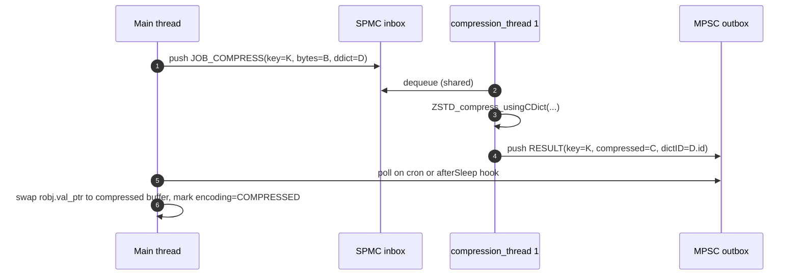

# Research — Existing Valkey building blocks we can reuse

_Scope: what concurrency / off-main-thread primitives already exist in Valkey and which ones are the right vehicle for background compression, training, and lazy free of compressed values._

## 1. Summary table

| Primitive | File | Purpose today | Fit for compression feature |
|---|---|---|---|
| `bio` (background I/O workers) | `src/bio.c`, `src/bio.h` | Dedicated single-worker-per-type pool for `close(2)`, `fsync`, lazy-free, diskless RDB save, TLS reload. | **Good fit for dictionary training** (long-running, low-rate, one-at-a-time). Not ideal for per-value compression because there's one worker per queue — can't scale. |
| `io_threads` | `src/io_threads.c`, `src/io_threads.h` | Parallelize socket read/write + RESP parsing and argv freeing. | **Tempting but risky for compression.** Currently scoped to network I/O; pulling compression in would couple data-plane CPU to I/O-thread count and blur ownership. See §3. |
| `lazyfree` | `src/lazyfree.c` | Free large objects on a bio worker thread via `decrRefCount`. | **Direct reuse**: compressed values are plain `robj`s and free through `decrRefCount`, so lazyfree already works. No change needed. |
| `childinfo` / `fork()` workers | `src/childinfo.c` | Fork-based: RDB save, AOF rewrite, diskless send, defrag hints. | Not applicable — we don't want to fork for per-value compression. |
| Modules event hooks | `src/module.c` | Keyspace events, cluster messages, timers, custom commands. | Relevant only as a future extensibility story (modules could register an alternative compression algorithm). Not on the v1 path. |

## 2. `bio` — shape and semantics

From `src/bio.h`:

```c
enum {
    BIO_CLOSE_FILE = 0, /* Deferred close(2) syscall. */
    BIO_AOF_FSYNC,      /* Deferred AOF fsync. */
    BIO_LAZY_FREE,      /* Deferred objects freeing. */
    BIO_CLOSE_AOF,      /* Deferred close for AOF files. */
    BIO_RDB_SAVE,       /* Deferred save RDB to disk on replica */
    BIO_TLS_RELOAD,     /* Deferred TLS reload. */
    BIO_NUM_OPS
};

void bioCreateLazyFreeJob(lazy_free_fn free_fn, int arg_count, ...);
void bioCreateCloseJob(int fd, int need_fsync, int need_reclaim_cache);
unsigned long bioPendingJobsOfType(int type);
void bioDrainWorker(int job_type);
```

Key properties:

- **One worker per job type** (mapped in `bio.c`'s `bio_job_to_worker[]` array).
- Jobs in a given queue are executed **FIFO, one at a time**.
- No completion notification back to the main thread today — fire-and-forget.
- Adding a new job type (say `BIO_COMPRESSION_TRAIN`) follows a well-trodden path.

**Where it fits the compression feature.** Perfect for:

- **Dictionary training.** Training is heavy and infrequent (minutes to hours cadence). FIFO, single-worker execution is fine.
- **Bulk post-training tasks**, e.g., a one-shot sweep that rebuilds `ZSTD_CDict/DDict` after new dictionary bytes land.

Not a fit for per-value compression, which needs parallelism and possibly a response channel.

## 3. `io_threads` — shape and semantics

From `src/io_threads.c` (abridged):

```c
static spmcQueue io_shared_inbox;   // Main → IO (shared, SPMC)
static mpscQueue io_shared_outbox;  // IO → Main (MPSC, responses)
static spscQueue io_private_inbox[IO_THREADS_MAX_NUM];  // Main → specific IO thread

void commitIOJobs(void);
int  inMainThread(void);
void drainIOThreadsQueue(void);
```

Capabilities already present:

- **Multiple worker threads**, configurable via `io-threads`.
- **Both shared and per-thread queues** with SPSC / SPMC / MPSC flavors.
- **Response channel** (`io_shared_outbox`) and a **pending-IO counter** (`getPendingIOThreadsJobs`).
- Tagged-pointer dispatch (`JOB_TAG_MASK`) so one worker can handle multiple job types.

**Tempting reuse.** We could add a compression job type and let io_threads dispatch it.

**Why we should not, at least not by default:**

1. **Separation of concerns.** `io_threads` exist to keep socket read/write off the main loop. Mixing CPU-bound compression into that pool means sizing one knob (`io-threads`) for two very different workloads. Operators cannot reason about it.
2. **Context overhead.** Each io_thread maintains TLS state for the RESP parser. Compression workers only need a `ZSTD_CCtx`/`ZSTD_DCtx` and the current CDict/DDict. A dedicated pool is simpler.
3. **Progressive adoption.** A dedicated pool (`compression-threads`) can be tuned / disabled independently. io_threads might be disabled (`io-threads 1`) while compression is on, and vice versa.
4. **Blast radius.** The feature should be isolated — if compression misbehaves, it must not degrade network I/O.

**Recommendation.** Introduce a **new pool**, shape it after `io_threads.c` (reuse the queue primitives `spscQueue`/`mpscQueue`/`spmcQueue` from `src/queues.h`), call it `compression_threads` (or `compression_workers`). Keep the code pattern identical so maintainers recognize it, but keep the scheduling separate.

## 4. `lazyfree` — already compatible

From `src/lazyfree.c`:

```c
void lazyfreeFreeObject(void *args[]) {
    robj *o = (robj *)args[0];
    decrRefCount(o);
    ...
}
```

- Compressed `robj`s free through `decrRefCount` just like regular ones; our new encoding's free path simply frees the compressed buffer (and, if coexistence cache is present, the uncompressed form).
- Large compressed blobs can still be lazy-freed; no change to lazyfree is needed beyond the normal `freeStringObject`-like dispatch on our new encoding.

## 5. Transactions and scripting disallow worker offload

Even though the compression pool exists, the **main thread will do compression / decompression directly** in these cases:

- **Inside `MULTI`/`EXEC`.** The transaction window is atomic and must complete in bounded time. Offloading to a worker would introduce a blocking round-trip and could deadlock against replication (`feedReplicationBuffer`) or the backlog.
- **Inside Lua / Functions (`EVAL`, `FCALL`).** Same reason: the scripting engine runs on the main thread and every `server.call` must return immediately.
- **On single-key reads with value smaller than a threshold.** Round-tripping through a worker queue is slower than in-place decompression for small values (POC observation).

The worker pool helps primarily for:

- **Background compression sweeps** (candidate queue of keys newly written or policy-flagged).
- **Multi-key commands** (`MGET`, `MSET`, `DEL`) where N keys can be dispatched in parallel.
- **Large-value async decompression**, with the client yielded back to the event loop while the worker runs.

## 6. Coordination pattern we will reuse



Notes:

- The main thread **always owns the `robj` mutation**. Workers never touch `robj`s directly — they consume/produce flat byte buffers.
- Polling can be hooked into the existing `afterSleep` / cron chain in `src/server.c` where `io_threads` already poll.

## 7. Queue primitives available

From `src/queues.h` / `src/mutexqueue.h` / `src/fifo.h`:

- `spscQueue` — single-producer single-consumer, lock-free.
- `spmcQueue` — single-producer multi-consumer, used by io_threads shared inbox.
- `mpscQueue` — multi-producer single-consumer, used by io_threads outbox.
- `mutexQueue` — simple mutex-protected queue; used by bio.

All three SPSC/SPMC/MPSC flavors are already battle-tested by `io_threads`. We can reuse them directly for the compression pool.

## 8. Cost of a new thread pool

Each compression thread carries:

- 1 × `ZSTD_CCtx` (a few MB for level 3 with dictionary, reported by `ZSTD_sizeof_CCtx`).
- 1 × `ZSTD_DCtx` (smaller; tens of KB).
- A small scratch buffer for the largest value on that worker.

For `compression-threads 4` (a reasonable default on modest hardware) the pool overhead is <50 MB. This is acceptable for a feature whose gains are measured in GB.

## 9. Summary

- **Reuse `bio`** for dictionary training (single long-running job at a time).
- **Reuse queue primitives** from `src/queues.h` and follow the `io_threads.c` shape, but **in a new dedicated pool**, for per-value compression/decompression.
- **Don't touch `lazyfree`** — it already handles compressed robjs correctly by virtue of going through `decrRefCount`.
- **Don't reuse `io_threads` directly** — keep concerns separated.

## References

- `src/bio.h`, `src/bio.c` — background I/O pool.
- `src/io_threads.h`, `src/io_threads.c` — I/O thread pool and queue usage pattern.
- `src/queues.h`, `src/mutexqueue.h` — queue primitives (SPSC/SPMC/MPSC).
- `src/lazyfree.c` — existing off-thread object free pattern.
