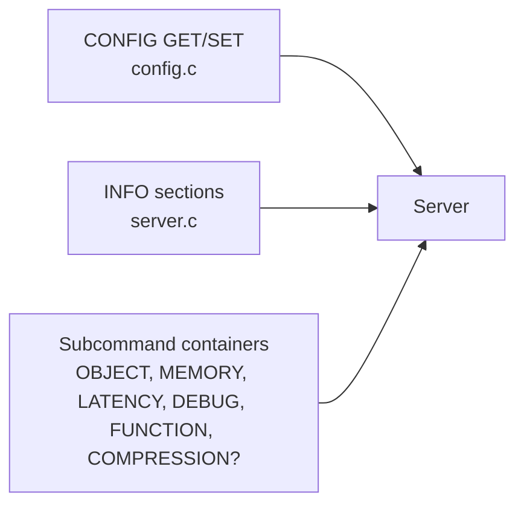
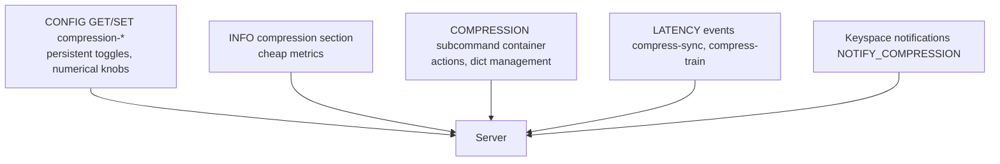

# Research — Metrics and admin surface

_Scope: how Valkey exposes observability and runtime controls today, and which precedent we should follow for the compression feature. Ties directly to the requirement "opt-in, configurable, metric-reporting, with admin commands to enable/disable/configure at runtime."_

## 1. Three surfaces available



Each surface solves a different job:

| Surface | Good for | Not for |
|---|---|---|
| `CONFIG GET/SET key val` | Enabling/disabling feature, numeric parameters, persistent (CONFIG REWRITE) | Expensive actions, state transitions requiring orchestration |
| `INFO <section>` | Cheap scalar metrics that operators and dashboards poll | Large rows per key, compound actions |
| Subcommand container (`OBJECT ENCODING`, `MEMORY USAGE`, `LATENCY RESET`, `FUNCTION LOAD`) | Grouping several related operations under a namespace, including actions | Simple on/off toggles (prefer CONFIG) |

## 2. Precedent we will follow

### Configuration → `CONFIG`

Pattern (`src/config.c`): each config entry registered via a `createBoolConfig / createLongLongConfig / createEnumConfig / createStringConfig` call. Consistent with existing features:

- `rdbcompression yes` — toggles LZF in RDB. Tracks exactly our "enable compression" affordance.
- `maxmemory-policy allkeys-lru` — enum config, directly testable via `server.maxmemory_policy`.
- `io-threads N` — integer config.

**Proposed configs for this feature:**

| Name | Type | Default | Meaning |
|---|---|---|---|
| `compression-enabled` | bool | `no` | Master switch. When `no`, feature is inert. |
| `compression-threads` | int | `0` (=auto) | Size of the new worker pool. |
| `compression-level` | int | `3` | zstd level (1..22). |
| `compression-min-value-size` | size | `256 B` | Skip values smaller than this. |
| `compression-lfu-threshold` | int | `5` | LFU counter threshold; skip hotter items. |
| `compression-lru-idle-seconds` | int | `60` | LRU idle floor; skip fresher items. |
| `compression-dict-size` | size | `102400` | Target zstd dictionary size. |
| `compression-dict-training-samples` | int | `10000` | How many values to reservoir-sample before training. |
| `compression-dict-refresh-interval` | time | `24h` | Cadence for drift-based retraining. |
| `compression-dict-drift-ratio` | percent | `70` | Ratio threshold that triggers retraining. |

All `MODIFIABLE_CONFIG` so `CONFIG SET` works at runtime. `CONFIG REWRITE` persists.

### Observability → `INFO` section

Pattern (`src/server.c`, inside `genValkeyInfoString`): each section gated by `all_sections || dictFind(section_dict, "<name>")`. The `memory`, `stats`, `clients` sections are the templates.

**Proposed new INFO section: `compression`:**

```
# Compression
compression_enabled:1
compression_active_dict_id:42
compression_known_dicts:2
compression_candidates_pending:118
compression_total_compressed_objects:9_423_012
compression_total_uncompressed_bytes:72_101_482_200
compression_total_compressed_bytes:29_880_614_100
compression_ratio:0.414
compression_live_ratio_10s:0.417
compression_live_ratio_10m:0.402
compression_dict_drift_triggered:0
compression_compressions_per_sec:12_400
compression_decompressions_per_sec:41_100
compression_worker_utilization_pct:23
compression_errors_total:0
```

All fields are derived from counters the implementation already maintains. Including them in a named section keeps the default `INFO` unchanged for operators who don't use the feature.

### Runtime actions → new top-level `COMPRESSION` command

We have three good subcommand-container precedents:

- `OBJECT ENCODING|IDLETIME|FREQ|REFCOUNT` — per-key introspection.
- `MEMORY USAGE|STATS|DOCTOR|PURGE|MALLOC-STATS` — mixed introspection + action.
- `FUNCTION LOAD|DUMP|FLUSH|RESTORE|STATS` — mixed definition + administration.

Adding a fourth, `COMPRESSION`, is the right precedent fit because the feature has several operations that don't all belong in `CONFIG`:

| Subcommand | Description |
|---|---|
| `COMPRESSION ENABLE` / `COMPRESSION DISABLE` | Convenience for flipping `compression-enabled` (could also be done via CONFIG SET, but this is atomic + logs the event in keyspace notifications). |
| `COMPRESSION STATUS` | Small summary (similar to `MEMORY STATS`). |
| `COMPRESSION TRAIN [SAMPLE <n>]` | Force a training cycle now, using up to _n_ sampled values. Useful for admins who just loaded a new dataset. |
| `COMPRESSION DICT LIST` | List known dictionary IDs, state (active/retiring/retired), refcounts. |
| `COMPRESSION DICT DROP <id>` | Retire a dictionary by id (only allowed if no live references; returns an error otherwise). |
| `COMPRESSION DICT EXPORT <id>` | Return the raw dictionary bytes so operators can inspect/back up out-of-band. |
| `COMPRESSION DICT IMPORT <bytes>` | Load a preshared dictionary — useful for deterministic fleet rollouts. |
| `COMPRESSION SWEEP` | Force a one-off background sweep of the keyspace to compress eligible keys now. |
| `COMPRESSION HELP` | Text help. |

Each subcommand's JSON lives under `src/commands/compression-<sub>.json` and the generator `utils/generate-command-code.py` emits the entries. Implementation goes into a new `src/compression.c`.

### ACL considerations

Subcommand surfaces go into a new ACL category `@compression` (like `@admin`, `@memory`). `COMPRESSION DICT DROP`/`IMPORT` are admin-only by default (`@admin`).

## 3. Keyspace-notification events

`src/notify.c` / `NOTIFY_*` flags: the feature should publish low-rate events so operators can wire alerting:

- `NOTIFY_COMPRESSION` (new bit) — events `training-started`, `training-complete`, `dict-promoted`, `dict-retired`, `sweep-complete`, `drift-detected`.

## 4. Latency tracking

`src/latency.c` already provides an "event-name + sample" infrastructure. We add two events:

- `compress-sync` — measured on the main thread for every inline decompression/compression.
- `compress-train` — measured once per training cycle (on bio thread, sampled).

Accessible via `LATENCY HISTORY compress-sync` etc. — free observability without any new command surface.

## 5. Module API exposure

Optional, minor: expose `ValkeyModule_GetCompressionStatus()` and `ValkeyModule_CompressionSetEnabled()` so a management module (or a service-level cluster controller) can orchestrate the feature without going through RESP. Not required for v1.

## 6. Sentinel / cluster considerations

- Sentinel does not participate directly; feature toggles are per-node configs. Sentinel may replicate `CONFIG SET` via `SENTINEL SET`, which already works generically.
- In a cluster, each node has its own dictionary registry and compression state. Dictionaries **are not** gossipped in v1. Nodes retrain independently. This is acceptable because compressed bytes never cross the cluster bus (MIGRATE decompresses — see `persistence-and-replication.md`).

## 7. Summary



- **Config**: one new `compression-*` namespace, all `MODIFIABLE_CONFIG`.
- **Metrics**: new `compression` INFO section.
- **Actions**: new top-level `COMPRESSION` subcommand container.
- **Latency + notifications** added for free using existing infrastructure.

## References

- `src/config.c` — `createBoolConfig`/`createEnumConfig`, `rdbcompression`, `io-threads`.
- `src/server.c` — `genValkeyInfoString` (INFO section composition).
- `src/object.c` — `objectCommand`, `memoryCommand` (subcommand-container pattern).
- `src/commands/object-*.json`, `src/commands/memory-*.json` — subcommand JSON metadata shape.
- `src/latency.c`, `src/notify.c` — latency + notification plumbing.
