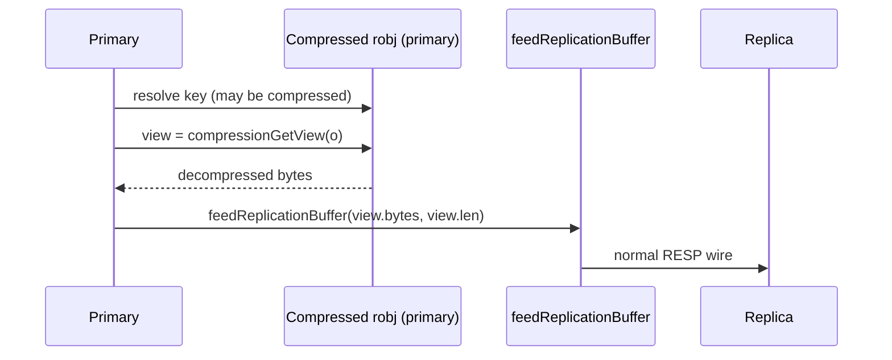
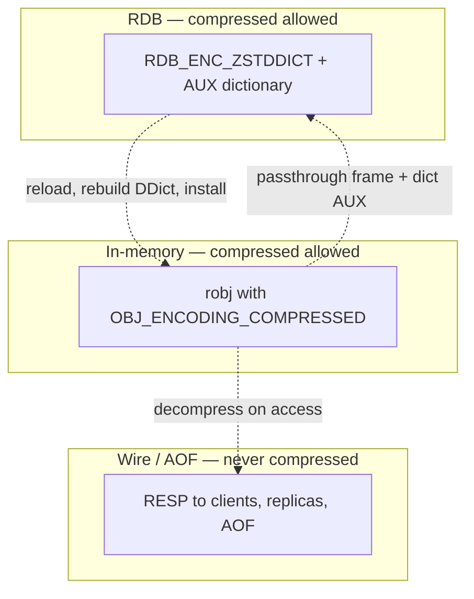

# Research — Persistence and replication

_Scope: how compressed values flow through RDB, AOF and replication. Goal: minimize blast radius on the wire and on disk._

## 1. Current state of Valkey persistence

- **RDB** (`src/rdb.c`, `src/rdb.h`): binary point-in-time snapshot. Strings can already be stored in a compressed form (**`RDB_ENC_LZF == 3`**), gated by `server.rdb_compression` (default on).
- **AOF** (`src/aof.c`): append-only log of RESP commands. AOF rewrite may include an RDB preamble.
- **Replication** (`src/replication.c`): primary streams commands to replicas through `feedReplicationBufferWithObject(robj*)`. Full sync uses an RDB stream.

Key constants:
- `RDB_VERSION = 80` (Valkey 9.0, `src/rdb.h`).
- Existing encoded string markers: `RDB_ENC_INT8/16/32`, `RDB_ENC_LZF`.
- `RDB_ENCVAL = 3` — the 2-bit code "specially encoded object follows."

## 2. Replication wire format: decompressed RESP

`src/replication.c`:

```c
void feedReplicationBufferWithObject(robj *o) {
    char llstr[LONG_STR_SIZE];
    void *p; size_t len;
    if (o->encoding == OBJ_ENCODING_INT) { ... }
    else {
        len = sdslen(objectGetVal(o));
        p = objectGetVal(o);
    }
    feedReplicationBuffer(p, len);
}
```

For compressed objects, `objectGetVal()` / `sdslen()` would return our compressed blob — **that is wrong on the wire**.

**Design decision:** steady-state replication **always sends decompressed bytes**, exactly matching the current RESP contract.



Implementation point: add a helper `robj *objectGetValUncompressed(robj *o, sds *tmp_out)` that, for compressed objects, decompresses into a scratch buffer owned by the caller; for non-compressed objects it returns the original pointer with zero cost. Replace the two `objectGetVal()` / `sdslen()` calls in `feedReplicationBufferWithObject` with the helper.

### Why keep the wire uncompressed?

1. **Smallest possible blast radius.** Replicas, older versions, Sentinel, modules — none need to know.
2. **Cross-version replication** stays trivial: replicas on older Valkey builds continue to work.
3. **Dictionary asymmetry.** The replica may not have our dictionary yet (during handshake / full sync) — sending compressed bytes would require shipping the dictionary first or embedding dictID lookups at the wire layer.
4. Only **cost** is that we decompress during replication feed. This is acceptable because replication is not the same hot path as client GETs, and we save the cost of the replica re-compressing on its side. (If a replica wants to compress, it does so itself with its own dictionary.)

## 3. AOF: decompressed RESP (same story)

AOF is a RESP log. `aof.c` serializes commands the same way RESP does. The same "decompress on the way out" helper used by replication is used here. No AOF format change. AOF rewrite (`BGREWRITEAOF`) typically includes an RDB preamble (see §4).

## 4. RDB: a new encoded string marker for ZSTD + dict

We want the RDB to preserve compressed values **without decompressing and re-compressing**. This saves RDB save time (the POC measured 36 s → 17 s on a 2.88 GB → 1.72 GB dataset) and keeps RDB size smaller.

### Proposed encoding

Add a new special marker alongside `RDB_ENC_LZF`:

```c
#define RDB_ENC_LZF      3   /* existing */
#define RDB_ENC_ZSTDDICT 4   /* new: ZSTD frame referencing a registered dictID */
```

Layout of a `ZSTDDICT`-encoded string on disk:

```
+--------+---------+----------+------------+-------------------+
| ENCVAL | dictID  | comp_len | orig_len   | ZSTD frame bytes  |
|  1 B   |  len-   |  len-    |  len-      |   comp_len bytes  |
|        | encoded | encoded  | encoded    |                   |
+--------+---------+----------+------------+-------------------+
```

Compared to the LZF layout, the only addition is the `dictID` prefix. `orig_len` lets the loader size the output buffer without parsing the frame header. `comp_len` bounds the read.

### Dictionary persistence in the RDB stream

Before the first compressed value is emitted, we need to persist the dictionary itself. Two good options:

- **Option A: new AUX opcode.** RDB already has an opcode for arbitrary aux key/value pairs (`RDB_OPCODE_AUX`). We emit one aux entry per dictionary: key = `"compression-dict-<N>"`, value = dictionary bytes. The loader sees these, re-builds DDicts, and is ready to decode frames with that dictID. Zero new opcode numbers needed; maximum compatibility.
- **Option B: dedicated new opcode** (e.g., `RDB_OPCODE_COMPRESSION_DICT`). Cleaner but requires a version bump and a loader change. Older loaders would fail on the new opcode.

**Preferred: Option A** — aux entries can be ignored by older loaders (they simply skip unknown aux pairs), which gives us forward compatibility for the dictionary payload. The `RDB_ENC_ZSTDDICT` marker itself is the hard dependency; RDBs containing it are unreadable by pre-feature versions.

### RDB version bump?

`RDB_VERSION` is currently `80`. Since we introduce a new `RDB_ENC_*` value, an older loader that encounters it will report "Unknown RDB string encoding type" and bail (`src/rdb.c`, inside `rdbGenericLoadStringObject`). We therefore **must** bump `RDB_VERSION` so that a new writer produces an RDB an old reader correctly refuses, and a new reader sees the higher version and activates compressed-string decoding. This matches precedent: every past encoding change bumped the version.

- New `RDB_VERSION = 81` (next integer).
- Extend `RDB_VERSION_MAP` with the Valkey release.
- Keep the LZF path for backward compatibility on load. New writes default to ZSTD+dict when the feature is enabled; fall back to uncompressed or LZF when it isn't.

### Loader invariants

- Loader encounters a `ZSTDDICT`-encoded value **before** the corresponding dictionary aux entry? → Error; refuse the RDB. (Writer must emit dictionaries first.)
- Loader encounters a dictID that was never emitted? → Error; refuse the RDB.
- `rdb-version-check strict` mode already rejects future versions (`src/rdb.c`).

## 5. Cluster `MIGRATE` and `RESTORE`

`MIGRATE`/`RESTORE` serialize a key as an RDB chunk with an `RDB_VERSION` prefix (`src/cluster.c`). After our changes:

- If the source has the feature **on** and the key is compressed, the source must either:
  - (a) emit the `ZSTDDICT` marker + a dictionary prelude in the chunk, or
  - (b) decompress before emitting and send uncompressed bytes.
- The path of least surprise is **(b)** for v1. Cluster migration is rare and the decompression cost is modest; avoiding the need to round-trip a dictionary to the destination is a big simplification. Revisit in v2 if measurement shows it matters.

## 6. `DUMP` / `RESTORE` on individual keys

Same reasoning as cluster migrate: v1 dumps decompressed bytes. Implementation: `DUMP` goes through the same "view as uncompressed" helper.

## 7. Summary diagram



## References

- `src/rdb.h` — `RDB_VERSION`, `RDB_ENC_*`, `RDB_VERSION_MAP`.
- `src/rdb.c` — `rdbSaveLzfBlob`, `rdbSaveLzfStringObject`, `rdbGenericLoadStringObject`, `rdbLoadLzfStringObject` (templates to imitate).
- `src/replication.c` — `feedReplicationBufferWithObject` (hook point).
- `src/aof.c` — AOF writer (uses same helpers).
- `src/cluster.c` — `MIGRATE`/`RESTORE` RDB chunk layout.
