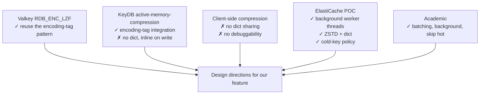

# Research — Prior art for in-memory value compression

_Scope: who has tried this before us, what they did, and what we can learn without blindly copying._

## 1. Redis / Valkey already has LZF — for RDB only

Valkey inherits **LZF-compressed string encoding in RDB** from Redis:

- `src/rdb.h`:
  ```c
  #define RDB_ENC_LZF 3   /* string compressed with FASTLZ */
  ```
- `src/rdb.c`:
  - `rdbSaveLzfBlob()` / `rdbSaveLzfStringObject()` — called from the RDB writer when `server.rdb_compression` is enabled and the string is long enough to justify compression.
  - `rdbLoadLzfStringObject()` — decompresses back to an sds on load.
- Config: `rdbcompression yes` (default, in `config.c`).

**Key precedent from this.** The RDB format **already tolerates "this encoded-length marker means a compressed payload follows"**. For our in-memory work we will not reuse LZF, but for the RDB integration story (persistence-and-replication.md) this is exactly the right structural template: a new `RDB_ENC_*` value for "ZSTD with dict `N`" that piggybacks on the same mechanism.

Redis does **not** compress values in memory today. The LZF path is strictly RDB (serialization).

## 2. KeyDB — closest real-world comparison

KeyDB (fork of Redis 6.x, now quiet since the Snap acquisition) briefly shipped an opt-in in-memory **LZ4** value compression feature (`active-memory-compression`, later renamed). Observations relevant to our design:

- **LZ4, not ZSTD-with-dict**, because LZ4 is lighter on CPU. This matches the POC's finding that plain LZ4 does poorly on small values — KeyDB's feature is most useful for large values.
- **Encoding-level integration** (similar to what we are proposing): a compressed object carries an encoding tag and callers transparently decompress on access.
- **No background worker model**: compression happens inline on insert. That simplifies the implementation but makes it a poor fit for latency-sensitive workloads — which is why we want background compression instead.
- **No dictionary.** Therefore ineffective for the small-value / highly-repetitive case that is most common in ElastiCache fleet analysis.

Takeaway: KeyDB validates the encoding-tag integration approach, but its inline-on-write design and lack of dictionaries are the things we specifically want to do differently.

## 3. Dragonfly — not comparable

Dragonfly is a from-scratch reimplementation. It uses a different core data structure and compacts data via type-specific encodings (listpack-like), not a generic compression layer. Not applicable as prior art for plugging into the Valkey `robj` model.

## 4. Client-side / module-side compression

The dominant workaround today is **application-level compression** (zlib, zstd, lz4 applied before `SET`). Evidence in `InternalCodeSearch`:

- Many Amazon-internal packages wrap compression around their Redis/Valkey clients (generally one-off zlib or gzip per value).
- External precedent: the "Object Cache Pro" PhpRedis extension links ZSTD/LZ4 and compresses transparently on the client side.

Problems with client-side compression, from the issue and reinforced by the POC doc:

- Complicates app logic and breaks debuggability (`redis-cli GET key` returns opaque bytes).
- Hard to apply consistently across a large fleet with mixed clients/languages.
- No server-side awareness → server cannot make memory decisions based on compressed size, dictionary training is impossible across clients.
- No dictionary sharing between different clients of the same dataset → every client pays its own dictionary cost or forgoes dictionaries entirely.

These are exactly the gaps the server-side feature fills.

## 5. KV-store compression research (academic)

Briefly surveyed:

- **MDPI 2023 "Requirements and Trade-Offs of Compression Techniques in KV Stores"** ([link](https://www.mdpi.com/2079-9292/12/20/4280)): survey of Snappy / ZSTD / LZ4 in KV stores. Confirms ZSTD-with-dictionary as the state of the art for small-value compression and flags drift management as the hardest lifecycle problem.
- **ACM SIGPLAN ISMM 2023 paper** ([link](https://dl.acm.org/doi/abs/10.1145/3591195.3595273)): block-level compression in KV stores; shows that performance impact can be reduced by (1) compressing in background, (2) skipping hot items, (3) batching. Independently confirms the POC's design directions.

## 6. Existing Valkey / Redis issues and PRs

- Valkey **#3423** (this project's source issue) — opened by `@ikolomi`.
- Redis `#10802` "Rethinking the main Redis dictionary" — discusses the hashtable overhaul that ultimately became Valkey's `hashtable.c`. Not about compression, but it is why `kvstore` + `hashtable` exist and why we target them as the seam rather than the legacy `dict`.
- No mainline-accepted Redis PR for in-memory value compression exists as of this research; the Redis community consistently closed such proposals because of blast-radius concerns. That is precisely the concern we have been asked to address head-on (minimize blast radius; encapsulate deep in the hashtable layer).

## 7. Internal AWS ElastiCache POC (reference only)

Summarized from `/home/ANT.AMAZON.COM/ikolomi/Downloads/Inline compression POC and fleet analysis.pdf`:

- Built on the **tiered-storage** and **CRR (cross-region replication) compression-worker** branches — i.e., an SPSC-queue + worker-thread skeleton that already existed internally.
- **STRING only** in the POC; other types bypassed.
- Background compression: **containers of 256 entries** batched from main thread → worker, worker compresses all, returns container; main thread marks entries compressed.
- Dual decompression: **sync** for small values (cheaper than round-trip), **async via workers** for large values (avoids main-thread CPU).
- "Coexistence" cache: decompressed form and compressed form live side-by-side for recently accessed keys, managed by a cyclic LRU-style array.
- Replication: **steady-state wire is uncompressed RESP**, full-sync RDB is **compressed end-to-end** (saves time and bytes).
- Observed impact: SW-ZSTD with dict, 80/20 GET/SET, 100% hit → **16–33% TPS degradation** depending on value size; higher fraction of that degradation is attributable to the block-client round-trip, not compression itself. HW compression on Graviton2 performs ~10–22% degradation.
- Observed memory win on XML-ish data: ~70% savings (matches the earlier fleet number).

The POC is **reference-only**. We are free to pick different design choices — in particular:

- Our design does not have to use the tiered-storage block-client mechanism at all; simpler "yield-back" patterns are available in Valkey's current event-loop model.
- We can decide whether to keep the container-batching or use a lighter per-key queue.
- We can replace "coexistence cache" with a simpler policy if metrics justify it.

## 8. Summary — what prior art tells us



- **Use ZSTD + dictionary** — not LZ4, not LZF (POC, academic, issue).
- **Encoding-tag integration inside `robj`**, not a new `robj.type` (KeyDB precedent + blast-radius requirement).
- **Background compression with worker threads** (POC, academic).
- **Skip hot items via LRU/LFU** (POC, academic).
- **Server-side dictionary life cycle** (the key gap application-level compression cannot fill).
- **Opt-in, observable, admin-controllable** (explicit requirement; also what the Redis community historically demanded before accepting such a feature).

## References

- MDPI, 2023 — [Requirements and Trade-Offs of Compression Techniques in KV Stores](https://www.mdpi.com/2079-9292/12/20/4280)
- ACM SIGPLAN ISMM, 2023 — [Proceedings article on KV-store compression](https://dl.acm.org/doi/abs/10.1145/3591195.3595273)
- [KeyDB Memory Optimization docs](https://docs.keydb.dev/docs/memory-optimization) (note: KeyDB docs do not highlight the in-memory compression feature heavily; its source is the authoritative reference).
- [Redis issue #10802 — Rethinking the main Redis dictionary](https://github.com/redis/redis/issues/10802)
- Internal: `Inline compression POC and fleet analysis.pdf` (reference only).
