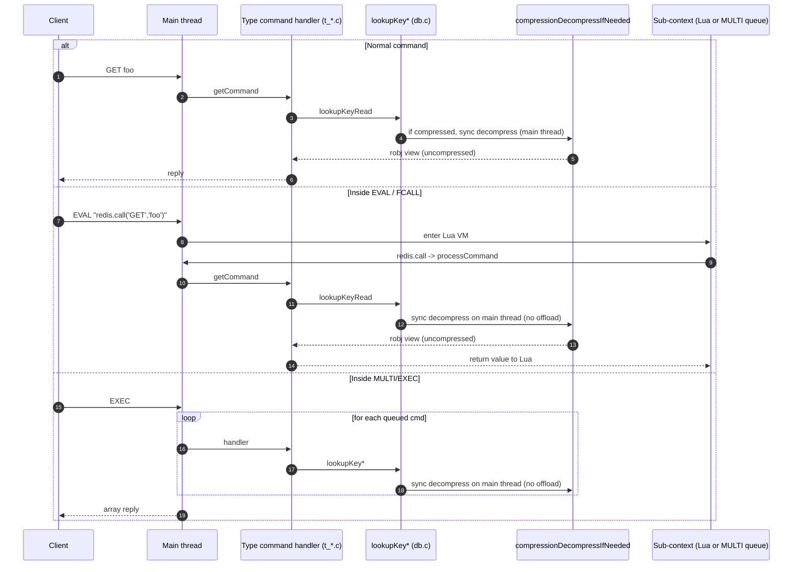

# Research — Scripting and transactions

_Scope: how Lua, Functions and `MULTI`/`EXEC`/`WATCH` interact with the keyspace, and where the compression feature must be careful. The headline: the hook point in `lookupKey*` makes scripting and transactions "just work" — with a handful of explicit invariants we must respect._

## 1. Lua / Functions — how values reach the script

Valkey exposes two scripting surfaces:

- Classic Lua: `EVAL`, `EVALSHA`, `SCRIPT LOAD` — implemented in `src/eval.c` and `src/modules/lua/script_lua.c`.
- Functions library: `FUNCTION LOAD`, `FCALL` — implemented in `src/functions.c` and `src/scripting_engine.c`. Today's only engine is Lua.

Both funnel every user command through `server.call(...)` / `redis.call(...)`:

```
Lua: redis.call("GET", "foo")
      │
      ▼
luaRedisGenericCommand (script_lua.c)
      │
      ▼
processCommand (server.c)     ← same path as a client RESP command
      │
      ▼
getCommand handler (t_string.c)
      │
      ▼
lookupKeyRead (db.c)          ← our decompression hook
      │
      ▼
returns robj*, the handler reads objectGetVal() / sdslen()
```

**Key implication.** The compression hook lives inside `lookupKey*`. Scripts and Functions get transparent decompression for free. No work needed in `script_lua.c` / `functions.c` themselves. The only constraint is that the "view as uncompressed" helper used by type-command handlers (e.g., `getCommand`) is also used consistently when the value is referenced.

### Scripts must never offload to a worker

Lua / Functions execute **synchronously on the main thread** within `call()`. Offloading a decompression to a worker and yielding back would:

- Break the scripting atomicity contract (script sees an inconsistent snapshot if another command runs in between).
- Break Lua's cooperative model: `luaRedisGenericCommand` expects `call()` to return before it returns to the Lua VM.
- Risk deadlock if the script is already holding a `WATCH`ed snapshot.

**Rule:** inside `processCommand` with a scripting-originated call (`c->flag.lua_client || in_fcall`), always use **sync, main-thread** decompression, regardless of `compression-threads` setting. No exceptions.

### Script cache and function library

- `SCRIPT LOAD` stores the script source keyed by sha1; not values, and not a candidate for compression in v1.
- `FUNCTION LOAD` stores function code similarly.

Scripts are control-plane data; the script cache/library is not managed by the compression feature. (Future extension could compress scripts too, but the memory is negligible and the cost of hitting an uncompressed branch before every `EVALSHA` would dominate. Out of scope.)

### Effects propagation

Scripts replicate their effects by replaying the inner commands through the normal propagation path (`alsoPropagate` / `feedReplicationBuffer` / AOF writer). Since those paths go through the "view as uncompressed" helper, **no change to replication/AOF semantics for scripts**.

### `BUILD_LUA=no`

Valkey can be built without the Lua engine (`BUILD_LUA=no` or module-form `BUILD_LUA=module`). The compression feature **must not** introduce any link-time or runtime dependency on Lua. The scripting engine interface (`src/scripting_engine.h`) is the right abstraction; we do not touch it.

## 2. Transactions — `MULTI` / `EXEC` / `WATCH` / `DISCARD`

Implementation lives in `src/multi.c`. Key points from reading the source:

### Command queuing (`MULTI` → commands → `EXEC`)

- `MULTI` sets `client.flag.multi`.
- Each subsequent command goes through `queueMultiCommand(c, cmd_flags)` which stores `{cmd, argv, argv_len}` into `client.mstate->commands[]`. **Values are not looked up at queue time.**
- `EXEC` iterates `mstate->commands[]` and calls the command handler for each one, inside a single-threaded, uninterrupted sequence.

**Implication for compression.** Decompression happens inside each command's handler (via `lookupKey*`). The transaction body sees decompressed values one command at a time, just like outside `MULTI`. No special handling required at the `multi.c` level.

### Atomicity and worker offload

The transaction body must complete atomically without blocking the main thread on external I/O. This forbids worker-thread offload mid-transaction:

```
For c->flag.multi == 1 && c->flag.in_exec == 1 (or server.in_exec):
    compression path MUST be: main-thread, synchronous, no queue round-trip.
```

Same rule as for scripts. We will gate this via a single predicate `compressionMustRunOnMainThread(c)` that returns true for:
- `c->flag.lua_client`
- `server.in_exec`
- Replication/AOF feed paths (replication already runs on the main thread but we document the rule)
- `BUILD_LUA=no` edge case: no change needed.

### `WATCH` and optimistic locking

`watchCommand(c)` / `watchForKey(c, key)` store `{db, key}` in `c->mstate->watched_keys`. The CAS mechanism relies on `signalModifiedKey(c, db, key)` calls made by **write** commands. If a watched key is modified between `WATCH` and `EXEC`, `c->flag.dirty_cas` becomes true and `EXEC` returns nil (the transaction is aborted).

**Critical invariant for compression.** Background re-compression (a compressor thread rewriting `robj->val_ptr` from sds to compressed blob) is a **storage-only change**, not a logical value change. It **must not** call `signalModifiedKey`. If we accidentally wire `signalModifiedKey` into the compressor path, every `WATCH`ed key silently gets `dirty_cas` set and `EXEC` returns nil. Very hard to debug.

Verification: the current writers that legitimately call `signalModifiedKey` are located by grep in the type files (`t_string.c`, `t_hash.c`, `t_set.c`, `t_zset.c`, `t_list.c`, `t_stream.c`, `bitops.c`, `hyperloglog.c`, `cluster.c`, `expire.c`, `evict.c`). The compressor must not be added to this list.

### Expire during `EXEC`

`EXEC` does not bypass expire checks. If a watched key expires mid-transaction, `isWatchedKeyExpired(c)` sets `dirty_cas`. Same invariant: compression-induced storage changes are not "modifications" from the watchcommand standpoint.

## 3. Client-side caching (`CLIENT TRACKING` / RESP3 invalidations)

`src/tracking.c`:
- `trackingInvalidateKey(c, keyobj, bcast)` is called from `signalModifiedKey` (see §2 above).
- Follows the same "logical vs storage" rule: background re-compression does **not** emit invalidations.

Good news: since we never call `signalModifiedKey` from the compressor, tracking is automatically correct. We explicitly do not need to touch `tracking.c`.

## 4. Summary diagram



## 5. Tests we will add

In Tcl (`tests/unit/type/string.tcl` style):

- `EVAL` on a compressed key returns identical bytes to the uncompressed path.
- `MULTI`/`EXEC` on a mix of compressed and uncompressed keys: result equal to non-compressed baseline.
- `WATCH key; MULTI; GET key; EXEC` with a background compressor actively rewriting `key` → `EXEC` must **not** abort.
- `WATCH key; MULTI; GET key; <another client SET key X>; EXEC` → must abort (unchanged behavior).
- `CLIENT TRACKING ON` + background compression of tracked key → no invalidations emitted.
- `BUILD_LUA=no` build: `compression-enabled yes` still works for non-scripting clients.

## 6. Summary

- Scripting and transactions **need no special code** in the script/multi layers — the decompression hook in `lookupKey*` is sufficient.
- Rules to enforce in the compression implementation:
  1. **Never offload** to a worker when `c->flag.lua_client`, `server.in_exec`, or on the replication/AOF feed path. Use main-thread sync decompression.
  2. **Never call `signalModifiedKey`** from the compression path. Re-compression is a storage change, not a logical one.
- Tests verify both rules explicitly.

## References

- `src/multi.c` — `multiCommand`, `queueMultiCommand`, `execCommand`, `watchCommand`, `watchForKey`.
- `src/db.c` — `signalModifiedKey`, `lookupKey*`, `isWatchedKeyExpired`.
- `src/tracking.c` — `trackingInvalidateKey` (called from `signalModifiedKey`).
- `src/modules/lua/script_lua.c` — `luaRedisGenericCommand` (scripting entry into `processCommand`).
- `src/functions.c`, `src/scripting_engine.c` — Functions path.
