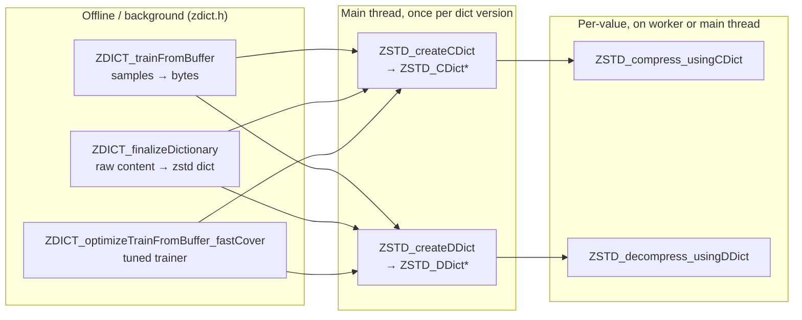

# Research — ZSTD dictionaries

_Scope: what the zstd C API gives us, what dictionaries cost, and how their lifecycle looks. This grounds the requirements around dictionary creation, persistence, drift and versioning._

Source: [`facebook/zstd/lib/zstd.h`](https://raw.githubusercontent.com/facebook/zstd/dev/lib/zstd.h) and [`zdict.h`](https://raw.githubusercontent.com/facebook/zstd/dev/lib/zdict.h) (v1.6.0 at time of research).

## 1. Why dictionaries for Valkey

Zstd without a dictionary does poorly on short buffers (< ~8 KB) because the frame header and entropy table overhead dominate. A **trained dictionary** carries precomputed entropy tables and a content prefix that is effectively prepended to every compressed frame. For small values this is exactly the win our POC and the AWS fleet analysis observed (≥50% savings on 92% of memory-bound snapshots).

The trade-off is a **new lifecycle object** (the dictionary itself) that must be:

- Produced from representative samples.
- Persisted across restarts, RDB loads and replica handovers.
- Versioned so that old compressed frames remain decodable.
- Refreshed when it stops matching the live dataset ("drift").

All of these are supplied by zstd's public API plus a little bookkeeping on our side.

## 2. Core API we will use



### Key entry points

| Function | Purpose | Cost profile |
|---|---|---|
| `ZDICT_trainFromBuffer(dictBuf, dictCap, samplesBuf, samplesSz, nbSamples)` | Canonical trainer. Wraps `optimizeTrainFromBuffer_fastCover` internally. Needs ≳ 100× dict size in sample bytes. | **Heavy** (~6 MB + linear in samples). Run off the hot path. Can take hundreds of milliseconds to minutes depending on sample volume. |
| `ZDICT_finalizeDictionary(...)` | Takes a raw content prefix plus samples and produces a proper zstd dictionary (with header, dictID, entropy tables). | Cheaper than full training. Useful for "seed a dict from known content." |
| `ZSTD_createCDict(dictBuf, dictSize, level)` | Digest the bytes into a prepared **compression** dictionary. | O(dictSize); paid once per dictionary version. |
| `ZSTD_createDDict(dictBuf, dictSize)` | Digest for **decompression**. | Cheaper than CDict. |
| `ZSTD_compress_usingCDict(cctx, dst, cap, src, srcSize, cdict)` | One-shot compression using a prepared dict. | On the hot path (worker). CCtx can be reused. |
| `ZSTD_decompress_usingDDict(dctx, dst, cap, src, srcSize, ddict)` | One-shot decompression. | Hot path. DCtx can be reused. |
| `ZSTD_getDictID_fromDict` / `_fromDDict` / `_fromFrame` | Extract the dictID that a dict or a compressed frame was built with. | Free, metadata only. |
| `ZSTD_DCtx_refDDict` with `ZSTD_d_refMultipleDDicts` | Decompressor can hold references to **multiple** DDicts keyed by `dictID`; frame header's `dictID` selects. | Enables the **"live dict N + retiring dict N-1"** story without re-encoding existing frames. |

### Thread-safety (from `zstd.h` and usage patterns)

- `ZSTD_CDict` and `ZSTD_DDict` are **immutable after creation** and **safe to share across threads** for read (compression/decompression).
- `ZSTD_CCtx` / `ZSTD_DCtx` are **not thread-safe**; keep one per worker thread.

This maps cleanly to Valkey's model: main thread creates CDict/DDict once and publishes pointers; workers each own their own CCtx/DCtx.

## 3. Memory cost of a dictionary

Two separate costs:

1. **The raw dictionary buffer.** Zstd docs recommend ~100 KB; can be as small as `ZDICT_DICTSIZE_MIN == 256` B or as large as a few MB. The default CLI uses 110 KB. Smaller dicts compress slightly worse but save memory and digest faster.
2. **Per-CDict/DDict digested form.** `ZSTD_sizeof_CDict(cdict)` and `ZSTD_sizeof_DDict(ddict)` report the actual bytes. A 100 KB dictionary typically digests to a few-hundred-KB CDict and ~100 KB DDict.

For Valkey, a single per-server dictionary of ~100 KB is a rounding error versus the memory savings it unlocks. If we ever go per-DB or per-slot, the fixed cost multiplies — keep this in mind for the requirements (probably: one dict per server, period).

## 4. Frame layout and dictID

Every zstd frame header optionally carries a 32-bit `dictID`. We will **always set it** (`ZSTD_c_dictIDFlag=1`, the default). That way each compressed value on disk or in memory is self-describing: readers look up the dictID in a small map to find the matching DDict.

- `ZSTD_getDictID_fromFrame(src, srcSize)` extracts this at near-zero cost.
- dictID space:
  - `<= 32767` is reserved for private use (safe for us on disk and in-memory).
  - `>= 2^31` is "high range" also safe for private use.
  - Middle range may be used by a public registry in the future — we avoid it.

## 5. Dictionary lifecycle in a Valkey-shaped system

```mermaid
sequenceDiagram
    autonumber
    participant Main as Main thread
    participant BG as Training worker (bio or new pool)
    participant W as Compression/decompression workers
    participant RDB as RDB / replication

    Main->>Main: boot; load dictionary registry from disk (if any)
    Note over Main,W: If no dict yet: feature stays idle; values go uncompressed.
    Main->>BG: submit "train" job with N sampled values
    BG->>BG: ZDICT_trainFromBuffer(...)
    BG->>Main: new dict bytes + proposed dictID
    Main->>Main: ZSTD_createCDict + ZSTD_createDDict
    Main->>W: publish CDict/DDict for new dictID (atomic pointer)
    Main->>Main: mark old dict as "retiring"; keep DDict for decode
    Main->>RDB: persist registry entry {dictID, bytes}
    loop while compressing
        W->>W: compress with current CDict
    end
    loop until no compressed frames reference old dict
        W->>W: decompress old frame with retiring DDict
    end
    Main->>Main: free retired DDict
```

### Dictionary registry (what we have to invent)

Zstd gives us dictID and multi-DDict support; Valkey must add:

- **In-memory registry**: `dictID -> {bytes, CDict, DDict, refcount, state (active|retiring|retired)}`.
- **On-disk persistence**: dictionary bytes + metadata included in RDB (new opcode) so replicas and restarts recover identically.
- **Refcount / eviction policy**: a DDict cannot be freed while any stored compressed frame still references its dictID. Because values are rewritten or expired over time, the old DDict eventually naturally becomes unreferenced — but we need a counter so we can tell.

## 6. Drift detection

Zstd does not have a built-in "how good is this dict today?" API. We synthesize one from metrics we already need for observability:

- **Observed compression ratio.** Maintain a rolling average of `uncompressed_bytes / compressed_bytes` over the last N compressions. Compare to the ratio measured immediately after training. If the live ratio drops below a configurable fraction (say 70%) of the post-training ratio, mark as drifted and schedule retraining.
- **Training sample reservoir.** Keep a small reservoir-sampled buffer of recently written values (say 1000 × average value size). Trigger retraining when (a) ratio regresses, or (b) a time-based cadence elapses (`compression-dict-refresh-interval`).

Both signals are free to compute given the observability metrics we plan anyway.

## 7. Compression levels and parameters

- Levels: `1..22` (positive), `0` means default (`ZSTD_CLEVEL_DEFAULT == 3`). Negative levels also exist (faster, worse ratio).
- For inline, latency-sensitive compression the sweet spot is usually **levels 1–3**. POC evidence: level 3 with a dictionary delivered the ≥50% savings target. Higher levels rapidly increase CPU.
- Parameters are sticky on a `ZSTD_CCtx` — reuse the context and the associated CDict across compressions for cheap amortized cost.

## 8. Error handling

All zstd return codes are `size_t`:

- `ZSTD_isError(ret)` — is it an error?
- `ZSTD_getErrorName(ret)` — human-readable string.
- `ZSTD_decompressBound(src, srcSize)` — upper bound on decompressed size, useful for sizing buffers.

Decompression can fail if the frame's dictID is not in our registry (e.g., loading an RDB whose dict was lost). Our design must fail loud (reject the RDB or fall back to treating the blob as an opaque sds — we will decide in requirements Q&A).

## 9. What we will _not_ use

- **Experimental section** (`ZSTD_STATIC_LINKING_ONLY`). We will link zstd dynamically (or as a regular vendored dep) — experimental APIs can change between versions.
- **Block-level sequence producer API**. Overkill and incompatible with dictionaries.
- **Multi-threaded compression inside zstd** (`ZSTD_c_nbWorkers`). Our parallelism is at the Valkey worker-thread level, not inside a single compression.

## 10. Summary for the design

- Single zstd dictionary per server is enough to start.
- Dictionary has an id (frame-embedded) and is versioned by us.
- Registry supports `N` DDicts concurrently; only one "active" CDict at a time.
- Training is heavy; always off the main thread, always on sampled data.
- Drift detection is derived from observability metrics, not a built-in zstd feature.

## References

- [zstd manual — dictionary API](https://facebook.github.io/zstd/zstd_manual.html#Chapter8)
- [zstd API reference `zstd.h`](https://raw.githubusercontent.com/facebook/zstd/dev/lib/zstd.h)
- [zstd dictionary builder `zdict.h`](https://raw.githubusercontent.com/facebook/zstd/dev/lib/zdict.h)
