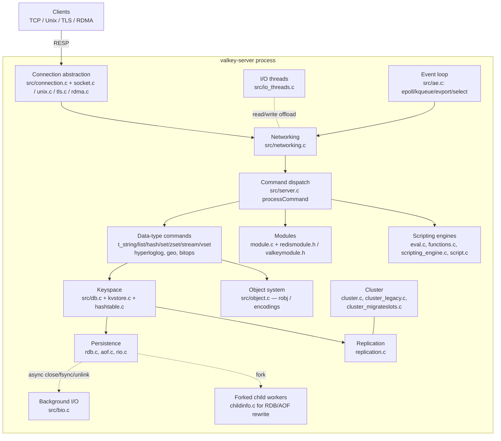
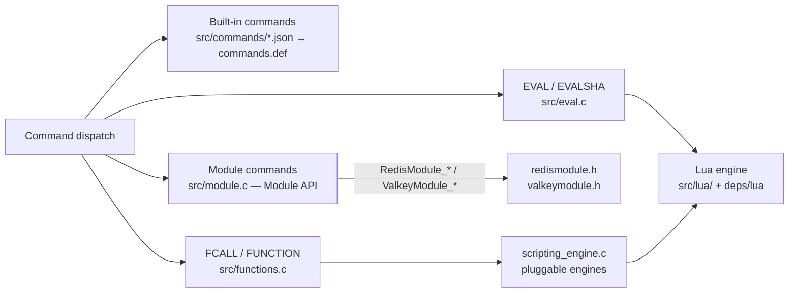
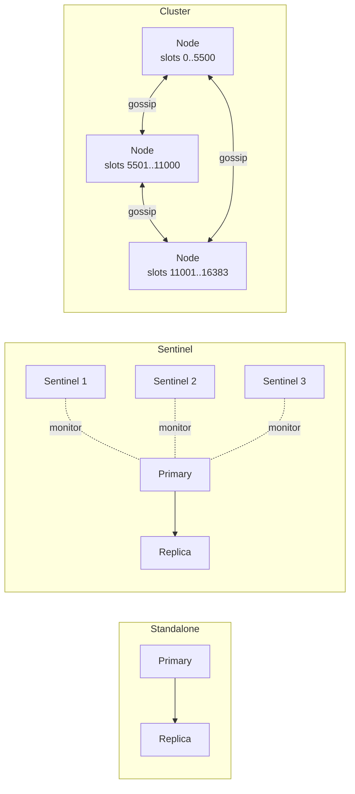

# Architecture

<!-- metadata: topic=architecture; audience=ai-agents,developers -->

## High-Level Picture

Valkey is a single-binary, primarily single-threaded-for-commands server that multiplexes many client connections over a non-blocking event loop. Commands mutate a set of keyspaces (logical databases) backed by an in-memory hashtable. Durability is provided by RDB snapshots and the AOF; horizontal scaling and HA by replication, Cluster mode, and Sentinel. Modules, Lua scripts, and Functions extend command behavior.



## Execution Model

- **Event loop (`src/ae.c`)** — portable wrapper over `epoll` (Linux), `kqueue` (BSD/macOS), `evport` (Solaris), or `select`. Registered via `ae_epoll.c` etc.
- **Main thread** is authoritative for command execution, keyspace mutation, and replication state. Data-structure operations are not locked because they do not run concurrently.
- **I/O threads (`src/io_threads.c`)** optionally parallelize only socket read/write and RESP parsing. The command is still executed on the main thread once the request has been parsed.
- **Background I/O (`src/bio.c`)** is a small worker pool used for operations that must not block the main thread, such as `close(fd)` on large files, `fsync`, and lazy free of large objects.
- **Forked child (`src/childinfo.c`)** handles cooperative copy-on-write workloads: RDB save, AOF rewrite, diskless replication, and defrag hints.
- **Threads manager (`src/threads_mngr.c`)** coordinates signal-based stack dumps.

## Storage Model

```mermaid
graph TB
    Server[struct valkeyServer<br/>src/server.h]
    Server --> DBs[redisDb[] — array of databases]
    DBs --> KV[kvstore<br/>src/kvstore.c]
    KV --> HT[hashtable<br/>src/hashtable.c]
    HT --> ROBJ[robj<br/>src/object.c]
    ROBJ -->|type + encoding| Enc[Encodings]
    Enc --> SDS[sds<br/>src/sds.c]
    Enc --> Listpack[listpack<br/>src/listpack.c]
    Enc --> Quicklist[quicklist<br/>src/quicklist.c]
    Enc --> Intset[intset<br/>src/intset.c]
    Enc --> Skiplist[skiplist in t_zset.c]
    Enc --> Stream[stream — rax-based<br/>src/t_stream.c + rax.c]
    Enc --> HLL[hyperloglog<br/>src/hyperloglog.c]
```

- **`kvstore`** shards a large database across multiple sub-hashtables. It is the unit of iteration for background tasks like active expiration and defrag.
- **`hashtable`** is the current primary hash table implementation. Older `src/dict.h`/`dict.c` is kept for backward compatibility but new code should use `hashtable`.
- **Object encodings** (`OBJ_ENCODING_*` in `src/server.h`) let the same logical type use different memory layouts depending on size (e.g., small hashes use listpack, large hashes use hashtable).

## Extensibility



- **Modules** are shared objects loaded at startup or via `MODULE LOAD`. They see a stable C ABI defined in `src/redismodule.h` (Redis-compat aliases) and `src/valkeymodule.h`. Modules can register new commands, new keyspace types (`RedisModuleType`), event hooks, ACL categories, and cluster message types.
- **TLS** and **RDMA** are themselves built as either statically-linked in `valkey-server` or as loadable modules (`valkey-tls.so`, `valkey-rdma.so`).
- **Scripting engines** implement a common C interface so future engines (beyond Lua) could plug in.

## High Availability Topologies



- **Sentinel** (`src/sentinel.c`) is the same `valkey-server` binary invoked with a sentinel configuration (or as `valkey-sentinel`); it monitors primaries, performs quorum-based failover, and notifies clients.
- **Cluster** shards the keyspace across 16384 hash slots. Two implementations coexist: `cluster_legacy.c` (the long-standing gossip-based protocol) and the newer support in `cluster.c` plus `cluster_migrateslots.c` (atomic slot migration — see `design-docs/atomic-slot-migration.md`).

## Persistence Model

- **RDB** — point-in-time binary snapshot written by a forked child. See `src/rdb.c`, `src/rdb.h`.
- **AOF** — append-only command log, with optional compaction ("AOF rewrite") via forked child. Multi-part AOF manifest format supported. See `src/aof.c`.
- **Hybrid** — modern default writes an RDB preamble inside the AOF.
- **`rio`** (`src/rio.c`) is an abstract I/O layer shared by RDB/AOF producers/consumers for file, socket, or in-memory targets.

## Configuration Surface

- Options parsed from `valkey.conf` (or `sentinel.conf`) or command-line; shape defined by macros in `src/config.c`. User-visible INFO fields are documented in the external valkey-doc repo's INFO command page.
- Persistent build options are cached in `src/.make-settings`; `make distclean` clears them.
