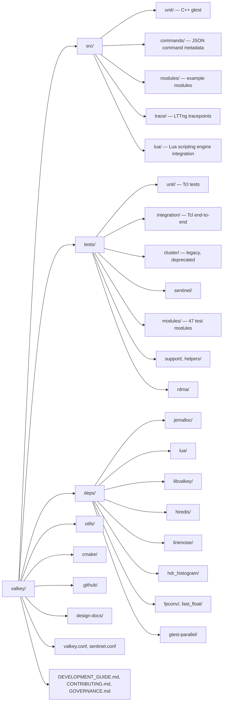

# Codebase Information

<!-- metadata: topic=overview; audience=ai-agents,developers -->

## Project

- **Name:** Valkey
- **Type:** High-performance in-memory data structure server (key/value store)
- **Origin:** Fork of Redis, taken right before Redis's transition to source-available licenses
- **License:** BSD-3-Clause
- **Governance:** Linux Foundation project, led by a Technical Steering Committee (see `GOVERNANCE.md`)
- **Upstream:** https://github.com/valkey-io/valkey
- **User docs:** https://github.com/valkey-io/valkey-doc

## Languages

| Language | Usage |
|---|---|
| C (gnu11 preferred, c99 fallback) | Server, CLI, benchmark tools, all runtime code under `src/` |
| C++ | Unit tests under `src/unit/` using GoogleTest/GoogleMock |
| Tcl | Integration tests under `tests/` |
| Python | Code generators (`utils/generate-command-code.py`, `generate-fmtargs.py`, etc.) |
| Ruby | Auxiliary utilities (`utils/generate-module-api-doc.rb`, `module-api-since.rb`) |
| Shell | Install and cert-generation scripts in `utils/` |
| JavaScript (Node) | `utils/reply_schema_linter.js` |

## Target Platforms

- Primary: Linux (x86_64, aarch64), macOS, \*BSD
- Best-effort: Solaris derivatives (SmartOS)
- Both 32-bit and 64-bit, both little- and big-endian

## Build Systems

Two parallel build systems are maintained:

- **Makefile** (primary / production): top-level `Makefile` forwards to `src/Makefile`. Most configuration flags documented in `README.md`.
- **CMake** (experimental): top-level `CMakeLists.txt`, modules under `cmake/Modules/`. Referenced as experimental in README; not all flows go through it.

## Produced Binaries

| Binary | Source entry | Purpose |
|---|---|---|
| `valkey-server` | `src/server.c` (main is `__attribute__((weak))` so tests can override) | The server; also runs as `valkey-sentinel` via symlink |
| `valkey-sentinel` | symlink to `valkey-server` | High-availability monitor (`src/sentinel.c`) |
| `valkey-cli` | `src/valkey-cli.c` | Interactive client / cluster admin tool |
| `valkey-benchmark` | `src/valkey-benchmark.c` | Load generator |
| `valkey-check-rdb` | `src/valkey-check-rdb.c` | RDB file validator |
| `valkey-check-aof` | `src/valkey-check-aof.c` | AOF file validator |

Redis-compatibility symlinks (`redis-server`, `redis-cli`, etc.) are created by `make install` by default (disable with `USE_REDIS_SYMLINKS=no`).

## Optional Build Features

Controlled at `make` invocation time and cached in `src/.make-settings`:

- `BUILD_TLS={yes|module|no}` — TLS over OpenSSL (built-in or loadable module)
- `BUILD_RDMA={yes|module|no}` — RDMA networking (Linux only, experimental)
- `BUILD_LUA={yes|module|no}` — Lua scripting engine (statically linked by default, can build as module or be omitted)
- `USE_SYSTEMD=yes` — systemd notifications
- `USE_LTTNG=yes` — LTTng userspace tracing (see `src/trace/README.md`)
- `USE_LIBBACKTRACE=yes` — richer stack traces
- `USE_JEMALLOC={yes|no}` / `MALLOC={libc|jemalloc|tcmalloc|tcmalloc_minimal}` — allocator selection (jemalloc default on Linux)
- `SANITIZER={address|undefined|thread}` — compile with a sanitizer
- `32bit`, `PROG_SUFFIX`, `USE_REDIS_SYMLINKS`, `NO_PROCESSOR_CLOCK` — misc

## Top-Level Directory Layout

## Key Top-Level Files

- `README.md` — quick start, build flags, run instructions
- `DEVELOPMENT_GUIDE.md` — style guide, naming, test-coverage expectations
- `CONTRIBUTING.md` — contribution process, DCO sign-off requirement
- `GOVERNANCE.md` — TSC model
- `MAINTAINERS.md` — current maintainers
- `SECURITY.md` — private disclosure to `security@lists.valkey.io`
- `AGENTS.md` — agent-facing navigation (this repo's convention)
- `valkey.conf`, `sentinel.conf` — sample/reference configuration files
- `runtest`, `runtest-cluster`, `runtest-sentinel`, `runtest-moduleapi`, `runtest-rdma` — Tcl test entrypoints
- `00-RELEASENOTES` — running release notes

## Command Catalog

- 425 command definitions under `src/commands/*.json` describe metadata (arity, flags, keys, ACL category, reply schema).
- `utils/generate-command-code.py` transforms these into `src/commands.def` (a large generated C file) that the server links in.
- Adding/changing a command ⇒ edit or add a `.json` under `src/commands/`, then regenerate.

## Scripting Engines

- **Lua** (`EVAL`, `EVALSHA`): `src/eval.c` + `src/lua/` integration + `deps/lua` (Lua 5.1 with local patches).
- **Functions** (`FUNCTION LOAD`, `FCALL`): `src/functions.c` and `src/scripting_engine.c` — pluggable engine API; the built-in Lua engine registers against it.
- `src/script.c` provides shared execution context, effects propagation, and error handling.

## Tracing

- LTTng userspace tracing under `src/trace/`. Enable with `USE_LTTNG=yes`. Events grouped by provider: `valkey_server`, `valkey_commands`, `valkey_db`, `valkey_cluster`, `valkey_rdb`, `valkey_aof`. See `src/trace/README.md`.

## CI & Quality Gates

Under `.github/workflows/`:

- `ci.yml` — pushes/PRs: build + integration + unit tests on multiple configurations
- `daily.yml` — nightly extended matrix (also supports manual `workflow_dispatch` on forks)
- `clang-format.yml` — enforces `clang-format-18` formatting on C/C++ sources
- `codeql-analysis.yml`, `coverity.yml`, `scorecard.yml` — security scanning
- `codecov.yml` — coverage upload
- `reply-schemas-linter.yml` — validates `src/commands/*.json` reply schemas
- `spell-check.yml` — typos check (config in `.config/typos.toml`)
- `benchmark-on-label.yml`, `benchmark-release.yml`, `weekly.yml` — performance
- `external.yml` — runs the suite against an external server

Path-scoped review instructions live in `.github/instructions/` (core-engine, integration-tests, utils). GitHub Copilot repository instructions live at `.github/copilot-instructions.md`.
