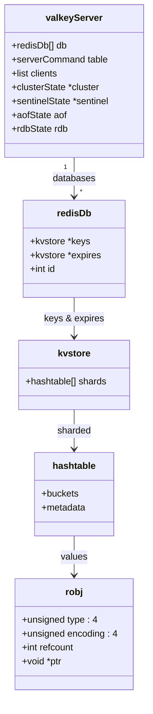

# Data Models

<!-- metadata: topic=data-models; audience=ai-agents,developers -->

Core in-memory structures. Line numbers are intentionally omitted because they drift; search for the type name in `src/server.h` or the indicated file.

## 1. Global Server State

- **`struct valkeyServer`** (`src/server.h`) — singleton global `server`. Holds configuration, event loop, the array of databases, the command table, ACL users, replication/cluster state, persistence state, stats, client lists, etc. Most subsystems reach into it by referencing the global.
- **`struct serverCommand`** (`src/server.h`) — command table entry. Populated from the generated `src/commands.def` plus any module-registered commands. Includes pointer to the C implementation, arity, flags, ACL category, key specs, subcommand table.

## 2. Keyspace

- **`redisDb`** — one per logical database (0..N-1, default N=16). Holds a `kvstore` for keys and another for TTLs/expires.
- **`kvstore`** (`src/kvstore.c`) — sharded container of `hashtable` instances. Shards are iterated lazily during background work.
- **`hashtable`** (`src/hashtable.c`) — the primary hash-table implementation. Replaces the older `dict` (`src/dict.c`) for new code paths.

## 3. Object System (`robj`)

The value stored against a key is always a `robj *` (`src/object.c`). It carries a type and an encoding:

### Types (`#define OBJ_* in src/server.h`)

| Constant | Value | Meaning |
|---|---|---|
| `OBJ_STRING` | 0 | string |
| `OBJ_LIST` | 1 | list |
| `OBJ_SET` | 2 | set |
| `OBJ_ZSET` | 3 | sorted set |
| `OBJ_HASH` | 4 | hash |
| (additional) | | stream, module, … (see `server.h`) |

### Encodings (`#define OBJ_ENCODING_* in src/server.h`)

| Constant | Used by |
|---|---|
| `OBJ_ENCODING_RAW` | long strings (`sds`) |
| `OBJ_ENCODING_INT` | string holding a small integer |
| `OBJ_ENCODING_EMBSTR` | short strings (embedded with the robj) |
| `OBJ_ENCODING_HASHTABLE` | large hashes / sets |
| `OBJ_ENCODING_INTSET` | integer-only sets |
| `OBJ_ENCODING_SKIPLIST` | large sorted sets (with companion hashtable) |
| `OBJ_ENCODING_LISTPACK` / `OBJ_ENCODING_QUICKLIST` | lists, small hashes, small sorted sets |
| `OBJ_ENCODING_ZIPLIST`, `OBJ_ENCODING_ZIPMAP`, `OBJ_ENCODING_LINKEDLIST` | legacy; retained for RDB compatibility only |
| `OBJ_ENCODING_STREAM` | streams (rax-based) |

Conversion between encodings happens automatically when thresholds from config are crossed (e.g., `hash-max-listpack-entries`, `hash-max-listpack-value`).

## 4. Client State

- **`client`** (`src/server.h`) — per-connection state: `connection *`, input query buffer, parsed argv/argc, reply buffer (`clientReplyBlock`), ACL user binding, pubsub subscriptions (`ClientPubSubData`), replication role data (`ClientReplicationData`), flags (`ClientFlags` bitfield struct), command in progress.
- **`connection`** (`src/connection.h`) — abstract connection with a `ConnectionType *type` vtable; concrete types: socket (TCP), unix, tls, rdma.
- **`ClientFlags`** — bitfield describing master/slave, multi, pubsub, reply-off, tracking, and more.

## 5. Data-Structure Primitives

| Structure | Defined in | Summary |
|---|---|---|
| `sds` | `src/sds.h` | Binary-safe dynamic string. Types `sdshdr5/8/16/32/64` select the length-prefix size. |
| `hashtable` | `src/hashtable.h` | Open-addressed chaining hash table with SIMD-friendly layout. |
| `dict` (legacy) | `src/dict.h` | Classic chained hash table; marked deprecated for new use. |
| `listpack` | `src/listpack.h` | Compact contiguous list; replaces ziplist. |
| `ziplist` | `src/ziplist.h` | Legacy compact list; retained for reading old RDBs. |
| `quicklist` | `src/quicklist.h` | Doubly-linked list of listpacks used by `OBJ_LIST`. |
| `intset` | `src/intset.h` | Sorted array of integers. |
| `zipmap` | `src/zipmap.h` | Legacy compact hash; retained for reading old RDBs. |
| `rax` | `src/rax.h` | Radix tree used by streams and client tracking. |
| `skiplist` | inside `src/t_zset.c` | Probabilistic ordered structure for sorted sets. |
| `list` | `src/adlist.h` | Plain doubly-linked list. |
| `vector` | `src/vector.h` | Dynamic array primitive. |
| `queues` / `mutexqueue` / `fifo` | `src/queues.h`, `mutexqueue.h`, `fifo.h` | Producer/consumer queues. |
| `entry` | `src/entry.h` | Key/value entry abstraction used by newer hashtable paths. |

## 6. Persistence Shapes

- **RDB** — binary, versioned (see `RDB_VERSION` in `src/rdb.h`). Contains aux fields, selected DB marker, key/value encoded per type, EOF with CRC64.
- **AOF** — text RESP commands replayed on load. Multi-part manifest splits base (often an RDB preamble) plus incremental files; format described in `tests/support/aofmanifest.tcl`.

## 7. Replication State

- **`replicationLink`** / `replicationBacklog` in `src/replication.c` track replication offset, buffered updates, and per-replica ACKs.
- **`clientReplicationData`** (`src/server.h`) hangs off primary or replica clients and holds PSYNC state.

## 8. Cluster State

- **`clusterState`** / **`clusterNode`** / **`clusterLink`** in `src/cluster_legacy.h`.
- **Slot table** — 16384 slots, CRC16(key)%16384.
- Slot migration metadata in `src/cluster_migrateslots.h`.
- Per-slot statistics in `src/cluster_slot_stats.h`.

## 9. ACL

- **`user`** (`src/acl.c`) — username, flags (enabled/disabled/nopass), password list, command-category allow/deny bitmaps, key and channel pattern lists.
- Command-to-category mapping is driven by each command's JSON metadata.

## 10. Scripting / Functions

- **Script cache** keyed by SHA1; stored alongside the scripting engine state.
- **Functions library** — compiled once under a library name; each exported function references an engine. Definitions in `src/functions.c`.
- **Scripting engine descriptor** — `src/scripting_engine.h` defines the vtable (`create`, `call`, `list`, `getMemoryUsage`, etc.) that engines implement.

## 11. Module-Defined Types

Modules register custom data types through `RedisModule_CreateDataType(ctx, name, encver, methods)`; see `src/modules/hellotype.c`. The server stores module-typed values in `robj` with `type == OBJ_MODULE` and a module-specific pointer.
