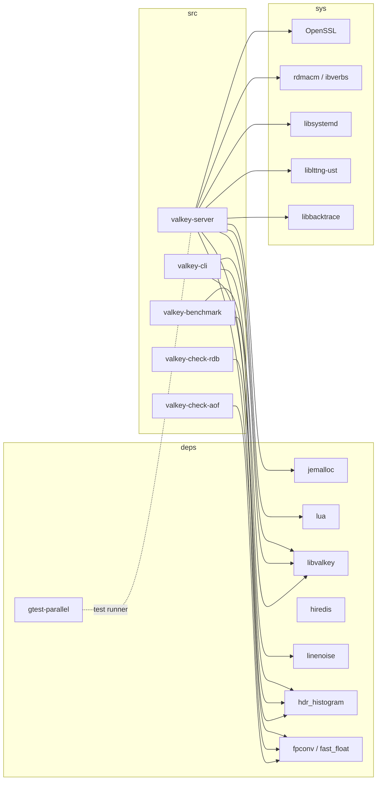

# Dependencies

<!-- metadata: topic=dependencies; audience=ai-agents,developers -->

Valkey keeps most runtime dependencies vendored under `deps/` so that builds are reproducible and predictable. See `deps/README.md` for upgrade procedures (generally `git subtree pull` from the upstream repo).

## 1. Vendored (under `deps/`)

| Dep | Why it's here | Notes |
|---|---|---|
| `jemalloc` | Default allocator on Linux. Patched to expose a `je_get_defrag_hint()` used by `src/defrag.c`. | Configured with `--with-lg-quantum=3` for better size-class fit. Upgrade via `git subtree pull`; then re-run `autogen.sh` and update the version in `deps/Makefile`. |
| `lua` | Built-in scripting engine (Lua 5.1). | Patched: Makefile portability, direct link of `lua_cjson`, `lua_struct`, `lua_cmsgpack`, `lua_bit`; security fix in `ldo.c` (blocks raw bytecode); MurmurHash3 in `lstring.c` for faster `luaS_newlstr`. Upgrade is manual — not planned. |
| `libvalkey` | Official C client library; used by `valkey-cli`, `valkey-benchmark`, `sentinel.c`. | Built without its own `sds` / `dict` — uses Valkey's. Upgrade via `git subtree pull` from `github.com/valkey-io/libvalkey`. |
| `hiredis` | Retained for compatibility paths. | `libvalkey` is preferred for new use. |
| `linenoise` | Line-editing for `valkey-cli`. | Unmodified; upgrade by drop-in replacement. |
| `hdr_histogram` | Per-command latency histograms. | Customized on top of a specific upstream commit (`e4448cf`). Upgrade is a manual 3-way merge. |
| `fast_float` / `fpconv` | Fast string↔double conversion. `ffc.h` is a C99 port of the C++ `fast_float` library. | Replacement for `strtod`; downloaded from `github.com/kolemannix/ffc.h`. |
| `gtest-parallel` | Runs GoogleTest binaries in parallel. Used by unit-test targets. | Subtree snapshot (not live subtree) of `google/gtest-parallel`. |

Dependency rebuilds are not automatic. After changing build flags or updating `deps/`, run `make distclean && make`.

## 2. System / External (linked but not vendored)

| Lib | Used for | Gate |
|---|---|---|
| libc malloc / `tcmalloc` | Alternative allocators | `MALLOC=libc` / `MALLOC=tcmalloc` / `MALLOC=tcmalloc_minimal` |
| OpenSSL (`libssl`, `libcrypto`) | TLS | `BUILD_TLS=yes` or `BUILD_TLS=module` |
| `librdmacm`, `libibverbs` | RDMA networking | `BUILD_RDMA=yes` or `BUILD_RDMA=module` (Linux only) |
| `libsystemd` | systemd readiness/status notifications | `USE_SYSTEMD=yes` (auto-detected by default) |
| `liblttng-ust` | Userspace tracing | `USE_LTTNG=yes` |
| `libbacktrace` | Enhanced crash stack traces (file:line) | `USE_LIBBACKTRACE=yes` |
| `libexecinfo` | Backtraces on BSDs | linked when `USE_BACKTRACE=yes` on \*BSD |
| `libatomic` | 32-bit ARM / ppc atomics | linked automatically on those architectures |
| `pthread`, `librt`, `libdl`, `libm` | Core POSIX | always |
| OpenSSL dev / TCL / tcl-tls | Running `./runtest` | user install; the test driver is Tcl |
| `libgtest-dev` / `libgmock-dev` | Building C++ unit tests | install manually or via CMake `BUILD_UNIT_GTESTS=yes` |

## 3. Build-Time Tools

| Tool | Purpose |
|---|---|
| `gcc` or `clang` (gnu11 preferred; falls back to c99 if `_Atomic` unsupported) | Compilation |
| `make` (GNU Make) | Primary build |
| `cmake` (≥ whatever `CMakeLists.txt` requires) | Experimental alternate build |
| `pkg-config` | Auto-detection of libssl / libcrypto / libsystemd / rdmacm |
| `python3` | `utils/generate-command-code.py`, `generate-fmtargs.py`, `req-res-log-validator.py`, `generate-wrappers.py`, `generate-redefine-syms.py` |
| `ruby` | `utils/generate-module-api-doc.rb`, `utils/module-api-since.rb` |
| `clang-format-18` | Formatting (enforced by CI) |
| `tcl` and `tcl-tls` | Running integration tests |
| `node` | `utils/reply_schema_linter.js` |

## 4. Runtime Dependency Notes

- **Allocator choice is sticky:** Flags are cached in `src/.make-settings`. Switching between `libc` and `jemalloc` (or 32-bit ↔ 64-bit) requires `make distclean` first.
- **Redis-compatibility symlinks:** `make install` creates `redis-server`, `redis-cli`, etc. as symlinks unless `USE_REDIS_SYMLINKS=no`.
- **Weak `main`:** `int main(...)` in `src/server.c` is declared `__attribute__((weak))` so unit-test executables can provide their own. Do not remove this attribute without coordinating with the gtest scaffolding in `src/unit/`.
- **Lua linking modes:** Default is static module (`modules/lua/libvalkeylua.a`); can also be a shared module or omitted. Flags: `BUILD_LUA={yes|module|no}`.

## 5. Dependency Graph (build-time, high level)

