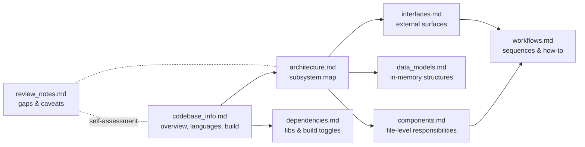

# Valkey Codebase Knowledge Base — Index

<!-- metadata: topic=index; audience=ai-agents -->

**For AI assistants:** This directory contains a structured overview of the Valkey codebase generated by the `codebase-summary` SOP. Use this `index.md` as the primary entry point into context. It summarizes what each sibling file contains so you can pull in the most relevant file for a given question without loading everything.

## How to use this knowledge base

1. Start here to decide which file answers the question at hand.
2. Load the referenced file(s) before reasoning about code.
3. When the question is about a specific source file, prefer reading the file itself from `src/` — these docs describe roles and relationships, not line-by-line behavior.
4. The consolidated `AGENTS.md` at the repo root is the lightweight everyday entry point; this knowledge base is the deeper reference.

## File directory

| File | When to consult | Content summary |
|---|---|---|
| [`codebase_info.md`](./codebase_info.md) | First-time overview, language/build questions, directory layout, CI surface | Project identity (Valkey fork of Redis, BSD-3), languages (C/C++/Tcl/Python/Ruby), build systems (Makefile + CMake), produced binaries, optional build features, top-level directory layout, command catalog, scripting engines, tracing, CI workflows |
| [`architecture.md`](./architecture.md) | Understanding the runtime model, threading, subsystem interactions | High-level diagram, execution model (main thread, I/O threads, bio, forked child), storage model (valkeyServer → redisDb → kvstore → hashtable → robj), extensibility (modules, Lua, Functions), HA topologies (standalone/Sentinel/Cluster), persistence model, configuration surface |
| [`components.md`](./components.md) | Finding which source files implement a given area | Per-file table organized by subsystem: server lifecycle, networking, data types, core data structures, persistence, replication/cluster/sentinel, scripting/modules, command metadata pipeline, tooling binaries, platform helpers, tracing, example modules, tests |
| [`interfaces.md`](./interfaces.md) | Questions about wire protocol, module API, scripting, persistence formats, admin commands, test harness entry points | RESP protocol + transports, command catalog pipeline (JSON → commands.def), Module API (redismodule.h / valkeymodule.h), Lua and Functions scripting, RDB/AOF formats, replication protocol, cluster bus, INFO/DEBUG/CONFIG/ACL admin surfaces, LTTng tracepoints, Tcl test harness |
| [`data_models.md`](./data_models.md) | Questions about in-memory structures, encodings, object system | `valkeyServer`, `redisDb`, `kvstore`, `hashtable`, `robj` with OBJ_* types and OBJ_ENCODING_* encodings, client state, primitive structures (sds, listpack, quicklist, intset, rax, skiplist, …), persistence shapes, replication and cluster state, ACL, module types |
| [`workflows.md`](./workflows.md) | How-to flows: request lifecycle, persistence, replication, failover, development, CI, adding commands/tests | Sequence diagrams for a client request, RDB save, AOF rewrite, replication handshake; guides for cluster slot migration, failover, dev loop, adding a new command, adding a unit test, running integration tests, CI path overview |
| [`dependencies.md`](./dependencies.md) | Questions about vendored or system libraries, build toggles, upgrade procedures | Vendored deps under `deps/` (jemalloc, lua, libvalkey, hiredis, linenoise, hdr_histogram, fast_float, gtest-parallel) with upgrade procedures; system libraries (OpenSSL, RDMA, systemd, LTTng, libbacktrace); build-time tools; dependency graph |
| [`review_notes.md`](./review_notes.md) | Self-report from the generator about gaps, inconsistencies, recommendations | Known limitations of this summary and suggestions for deeper manual exploration |

## Relationships between files

## Suggested reading paths

- **"What is this repo?"** → `codebase_info.md` alone is usually enough.
- **"Where would I add X?"** → `components.md` + `workflows.md`.
- **"How does a write propagate to replicas / AOF?"** → `architecture.md` + `workflows.md`.
- **"What's the shape of a stored value?"** → `data_models.md`.
- **"How do modules talk to the server?"** → `interfaces.md` §3.
- **"Why does jemalloc matter here?"** → `dependencies.md` §1 + `components.md` §1 (defrag entry).
- **"How do I run just one test?"** → `workflows.md` §9–10, `interfaces.md` §9.

## Example questions this knowledge base answers well

- What binaries does the build produce and which source files feed each?
- Where is the RESP parser, and where is the scheduling/dispatch loop?
- What's the difference between `dict.c` and `hashtable.c`, and which should new code use?
- Which file implements cluster slot migration (legacy vs atomic)?
- What LTTng providers exist and what events do they emit?
- What CI checks run on a PR, and what will block merge?
- How do I add a new command end-to-end?

## Example questions this knowledge base does NOT answer (and where to go)

- Specific command semantics → `src/commands/*.json` and the upstream [valkey-doc](https://github.com/valkey-io/valkey-doc) repo.
- Precise line numbers in headers → read the header directly; avoid citing line numbers from docs, they drift.
- Function call graphs at a fine grain → grep/navigate the source.
- Configuration default values → `valkey.conf` and `src/config.c`.
