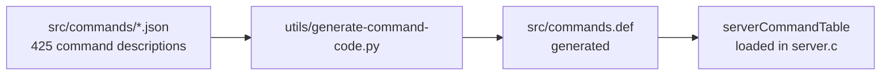

# Interfaces

<!-- metadata: topic=interfaces; audience=ai-agents,developers -->

Stable and semi-stable surfaces that Valkey exposes to clients, modules, tests, and operators.

## 1. Client Wire Protocol — RESP

- **Protocol:** RESP (v2) and RESP3. Implementations are spread across `src/networking.c` (request/reply framing for the server) and `src/resp_parser.c` (used by modules' call-reply path).
- **Transports:**
  - TCP (`src/socket.c`) — the default, port 6379.
  - Unix domain sockets (`src/unix.c`).
  - TLS over TCP (`src/tls.c`) — when `BUILD_TLS=yes` or when the `valkey-tls` module is loaded; configured with `--tls-port`, `--tls-cert-file`, `--tls-key-file`, `--tls-ca-cert-file`.
  - RDMA (`src/rdma.c`, Linux only, experimental) — `--rdma-bind`, `--rdma-port`, or `--loadmodule valkey-rdma.so`.
- **Pipelining & threading:** With `io-threads` configured, reads and writes can be parallelized by worker threads in `src/io_threads.c`, but commands themselves execute on the main thread.

## 2. Command Catalog

- Each command is described in `src/commands/<NAME>.json`: arity, flags, ACL category, key specs, arguments tree, reply schema.
- `utils/generate-command-code.py` must be re-run when a `.json` file is added or changed. The generated `src/commands.def` is checked in.
- Subcommands (`CLUSTER ...`, `CLIENT ...`, etc.) live in per-container subdirectories under `src/commands/`.
- CI workflow `.github/workflows/reply-schemas-linter.yml` validates reply schemas via `utils/reply-schema-linter/`.

## 3. Module API

Modules load shared objects that register commands, types, hooks, and event handlers.

- **Headers:** `src/redismodule.h` (Redis-compatible names) and `src/valkeymodule.h` (Valkey-branded names; both sets of symbols are exposed). Modules typically `#define REDISMODULE_CORE` only inside the server and use one of the public aliases elsewhere.
- **Entry point:** Modules implement `int RedisModule_OnLoad(RedisModuleCtx *ctx, RedisModuleString **argv, int argc)` (or `ValkeyModule_OnLoad` equivalent). Optional `RedisModule_OnUnload`.
- **Implementation:** `src/module.c` provides the server-side `RM_*` / `VM_*` functions. `src/call_reply.c` is used to expose command results to modules as structured replies.
- **Example modules** are shipped under `src/modules/` (hellodict, hellotype, helloblock, helloacl, hellocluster, hellohook, hellotimer, helloworld) as a learning aid.
- **Test harness:** `tests/modules/*.c` contains 47 test modules exercising specific API areas; they are built and consumed by `./runtest-moduleapi`.
- **Documentation:** `utils/generate-module-api-doc.rb` and `utils/module-api-since.rb` generate module API docs from source comments.

## 4. Scripting Interfaces

| Surface | Entry commands | Implementation |
|---|---|---|
| Lua scripts | `EVAL`, `EVALSHA`, `SCRIPT LOAD` | `src/eval.c` + `src/lua/script_lua.c` + `deps/lua` |
| Functions library | `FUNCTION LOAD`, `FUNCTION LIST`, `FCALL`, `FCALL_RO` | `src/functions.c` + `src/scripting_engine.c` |
| Pluggable engine registration | — (C API, used by engines) | `src/scripting_engine.h` |

- `src/script.c` holds per-invocation state shared by both paths: write/read-only flag, effects propagation, keys, error handling.
- Built-in Lua engine can be omitted entirely with `BUILD_LUA=no` (the `FCALL` surface remains, but has no registered engines).

## 5. Persistence Formats

| Format | Producer / consumer | Validator |
|---|---|---|
| RDB (binary snapshot) | `src/rdb.c` | `src/valkey-check-rdb.c` |
| AOF (append-only log, multi-part manifest supported) | `src/aof.c` | `src/valkey-check-aof.c` |
| Shared I/O abstraction | `src/rio.c` / `rio.h` | — |

- RDB versioning constants live in `src/rdb.h`.
- AOF manifest format is documented in `tests/support/aofmanifest.tcl` and exercised by `tests/integration/aof-multi-part.tcl`.

## 6. Replication Protocol

- Initiated from replica with `REPLICAOF` / `SLAVEOF`. Handshake drives PSYNC negotiation, RDB full sync (disk or diskless), then streaming command propagation.
- Implementation in `src/replication.c`; cross-version behavior exercised in `tests/integration/cross-version-replication.tcl` and `tests/integration/dual-channel-replication.tcl`.

## 7. Cluster Bus

- Node-to-node bus on port `client_port + 10000` by default.
- Packet types defined in `src/cluster_legacy.h`.
- `src/cluster_migrateslots.c` implements the newer atomic slot migration handshake (see `design-docs/atomic-slot-migration.md`).
- CRC16 slot hashing in `src/crc16.c` + `crc16_slottable.c`.

## 8. Administrative / Observability Interfaces

- `INFO` — sectioned server statistics; fields documented in the upstream valkey-doc `commands/info.md`.
- `DEBUG` family — implemented in `src/debug.c`, includes `OBJECT`, `SLEEP`, `JMAP`, crash-provocation, etc. Tests gated by the `needs:debug` tag.
- `CONFIG GET` / `CONFIG SET` / `CONFIG REWRITE` — implemented in `src/config.c`.
- `COMMAND`, `COMMAND DOCS`, `COMMAND INFO`, `COMMAND GETKEYS` — reflect metadata loaded from `src/commands.def`.
- `LATENCY` — event-based latency history from `src/latency.c`.
- `SLOWLOG` / `COMMANDLOG` — from `src/commandlog.c`.
- `CLIENT` — introspection / pausing / killing from `src/networking.c`.
- `ACL` — user and rule management from `src/acl.c`.
- **LTTng tracepoints** — enabled with `USE_LTTNG=yes`; providers `valkey_server`, `valkey_commands`, `valkey_db`, `valkey_cluster`, `valkey_rdb`, `valkey_aof`. Full list in `src/trace/README.md`.

## 9. Test Harness Interfaces

- **Tcl harness entry points:** `runtest`, `runtest-cluster`, `runtest-sentinel`, `runtest-moduleapi`, `runtest-rdma`.
- **Single-test form:** `./runtest --single unit/<name>`.
- **External server mode:** `./runtest --host <h> --port 
` skips tests tagged `external:skip`.
- **Tags** (defined in `tests/support/util.tcl`) drive conditional skipping: `external:skip`, `cluster`, `cluster:skip`, `large-memory`, `tls`, `tls:skip`, `ipv6`, `needs:repl`, `needs:debug`, `needs:pfdebug`, `needs:config-maxmemory`, `needs:config-resetstat`, `needs:reset`, `needs:save`, `needs:other-server`, `compatible-redis`, `network`, `singledb`, `valgrind:skip`.
- **Debugger helper:** `bp <label>` in Tcl tests drops into a minimal interactive debugger.
- **Unit test glue:** `src/unit/wrappers.h` lists symbols to be intercepted; `generate-wrappers.py` emits `ld --wrap` stubs that delegate to Mock / Real implementations; `generate-redefine-syms.py` renames colliding symbols.

## 10. Installation / Runtime Integration

- `make install` installs binaries and, by default, Redis-compatibility symlinks. `USE_REDIS_SYMLINKS=no` disables symlinks.
- `utils/install_server.sh` (Linux only) generates `/etc/init.d/valkey_<port>` init scripts.
- systemd unit templates at `utils/systemd-valkey_server.service` and `utils/systemd-valkey_multiple_servers@.service`.
- Sample configs: `valkey.conf`, `sentinel.conf` at repo root.
