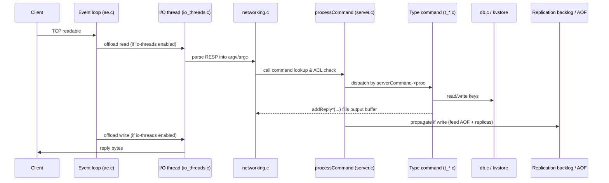
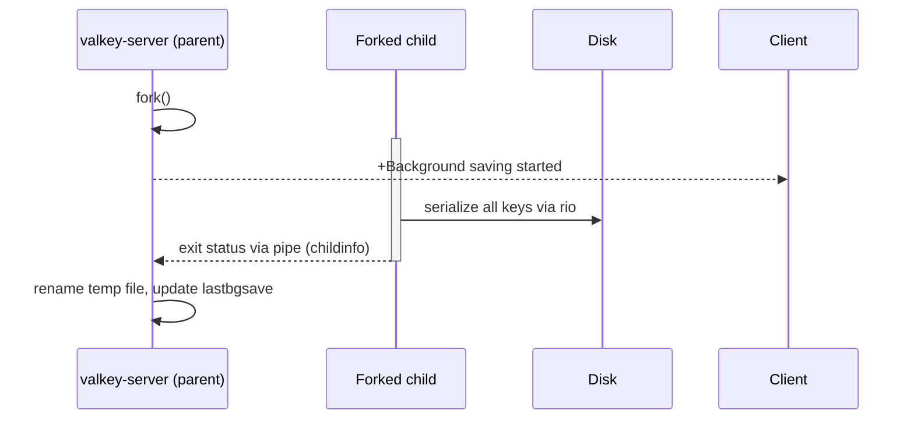
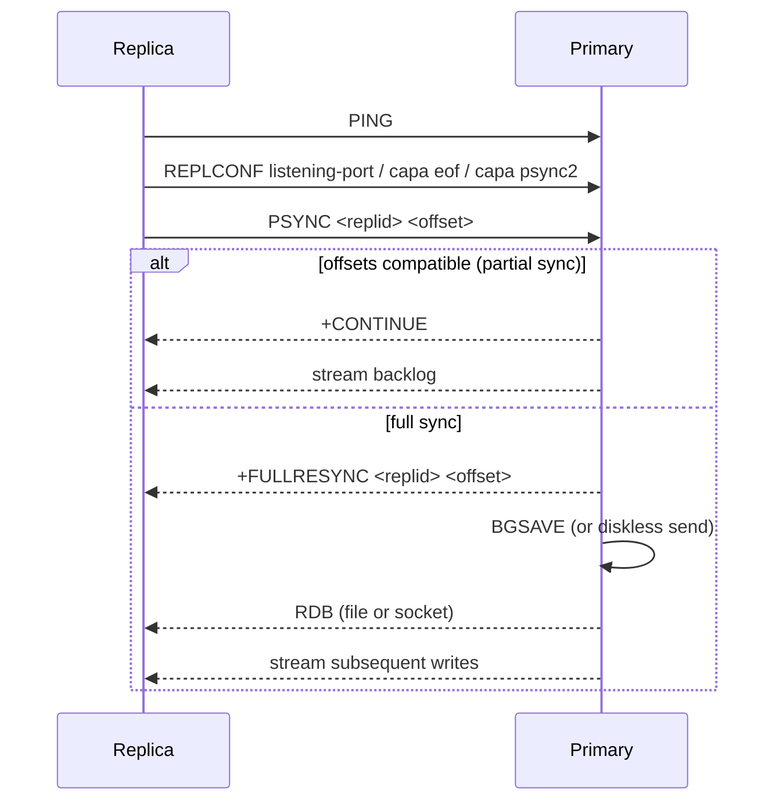

# Workflows

<!-- metadata: topic=workflows; audience=ai-agents,developers -->

## 1. Client Request Lifecycle

Key invariants enforced in `processCommand`:

- Deny-by-ACL, deny-because-readonly, deny-because-OOM checks.
- Cluster redirect (`-MOVED` / `-ASK`) computed from `crc16(key) % 16384`.
- Scripts and transactions run atomically with respect to command dispatch.

## 2. Starting the Server

- `make` (or `make distclean && make` after toggling build flags) produces `src/valkey-server`.
- Run with `./src/valkey-server [path/to/valkey.conf] [--option value ...]`. CLI options override config file.
- In sentinel mode, run `./src/valkey-sentinel sentinel.conf` or set `sentinel` in config.

## 3. Persistence Workflows

### RDB save (`BGSAVE` / `SAVE`)

### AOF rewrite (`BGREWRITEAOF`)

Same fork-based pattern, but the child writes a compact AOF (or RDB preamble + incremental commands). The parent buffers incremental writes during rewrite and appends them afterward. Manifest format is multi-part (see `tests/integration/aof-multi-part.tcl`).

## 4. Replication Handshake

Dual-channel replication (`tests/integration/dual-channel-replication.tcl`) adds a separate channel for the RDB transfer.

## 5. Cluster Slot Migration

Two coexisting implementations:

- **Legacy** — `CLUSTER SETSLOT IMPORTING/MIGRATING`, key-by-key `MIGRATE`. Source in `src/cluster_legacy.c`.
- **Atomic slot migration** — new design; non-blocking, coordinated across a slot range. Source in `src/cluster_migrateslots.c`; design in `design-docs/atomic-slot-migration.md`; tests in `tests/unit/cluster/cluster-migrateslots.tcl`.

## 6. Failover

- **Cluster failover:** A replica with majority acknowledgment promotes itself after the primary is marked FAIL via gossip. Manual failover (`CLUSTER FAILOVER`) is also supported (`tests/unit/cluster/manual-failover.tcl`).
- **Sentinel failover:** Sentinels reach quorum on subjective-down → objective-down → elect a leader → pick the best replica → reconfigure.
- **Standalone failover:** `FAILOVER` command orchestrates a coordinated handover (`tests/integration/failover.tcl`).

## 7. Development Loop

- **Formatting:** `clang-format-18` is enforced by `.github/workflows/clang-format.yml`. The project's `.clang-format` lives at `src/.clang-format`.
- **DCO:** Every commit must carry `Signed-off-by: Name <email>` (use `git commit -s`). Checked by CI and by the human reviewers.
- **PR scope:** Separate refactoring from functional changes to ease backports (`DEVELOPMENT_GUIDE.md`).

## 8. Adding a New Command

1. Create or update `src/commands/<NAME>.json` (or a subcommand under a container directory) with arity, flags, keys, args, reply_schema, ACL categories.
2. Run `python3 utils/generate-command-code.py` to regenerate `src/commands.def`.
3. Implement the command function, prototype in `src/server.h` (or the relevant module), body in the appropriate `t_*.c` or new file.
4. Register any new `.c` source file in `src/Makefile` (in `ENGINE_SERVER_OBJ`) and in `src/CMakeLists.txt`.
5. Add integration tests in `tests/unit/<area>.tcl` or a new file; reference them from `tests/test_helper.tcl` if required.
6. If user-facing, open a corresponding valkey-doc PR.

## 9. Adding a Unit Test (C++ gtest)

1. Add `src/unit/test_<subject>.cpp` using `TEST(...)` macros.
2. If the test needs to mock a server-internal function, add the symbol to `src/unit/wrappers.h`; the `generate-wrappers.py` script regenerates glue on next `make test-unit`.
3. Run `make -C src test-unit` (filter with `UNIT_TEST_PATTERN='Class.Prefix*'`).
4. Disabled tests are prefixed `DISABLED_` and run only with `--gtest_also_run_disabled_tests`.

## 10. Running Integration Tests

- Full suite: `make test` (from repo root).
- Single file: `./runtest --single <path/to/test.tcl>` (relative to `tests/`).
- Cluster: `./runtest-cluster` (writes under `tests/unit/cluster/`; do not add tests to the deprecated `tests/cluster/`).
- Sentinel: `./runtest-sentinel`.
- Module API: `./runtest-moduleapi`.
- TLS: build with `BUILD_TLS=yes` and generate certs via `./utils/gen-test-certs.sh`; add `--tls` or `--tls-module`.

## 11. CI Path Overview

- **Push / PR:** `ci.yml` runs a matrix of builds (libc/jemalloc, sanitizers, TLS on/off, Lua on/off), integration tests, and unit tests.
- **Daily:** `daily.yml` expands the matrix and can be dispatched manually from a fork via GitHub Actions.
- **Static checks:** `clang-format.yml`, `codeql-analysis.yml`, `coverity.yml`, `scorecard.yml`, `spell-check.yml`, `reply-schemas-linter.yml`.
- **Performance:** `benchmark-on-label.yml`, `benchmark-release.yml`, `weekly.yml`. Public perf dashboards are linked from `README.md`.
