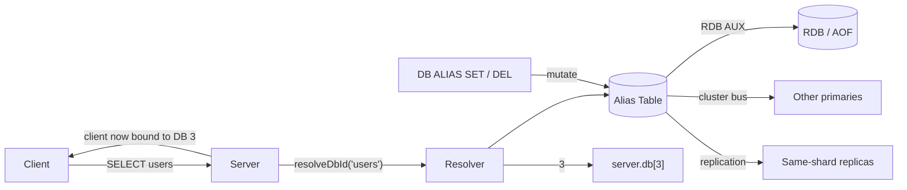
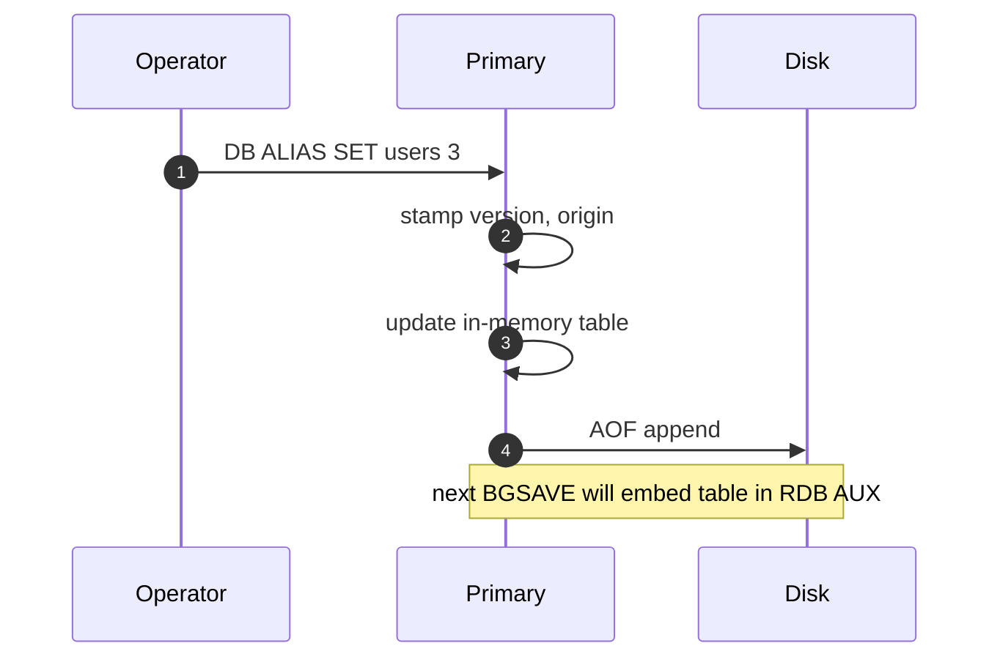

# Named Databases for Valkey — High-Level Design

**Status:** Draft — **two approaches under reviewer consideration; see § Approaches under consideration**
**Author:** `eifrah-aws`
**Last updated:** 2026-05-24

---

## Motivation

Valkey clients today address databases by integer id only:

```
SELECT 0
SELECT 3
```

Numbered databases are easy to mistype, easy to misroute, and provide no
self-documentation in logs, dashboards, or runbooks. Operators repeatedly
ask whether a particular database holds *user profiles*, *session state*,
or *animal records* — and the answer lives only in tribal knowledge.

This proposal adds **human-readable aliases** for the existing numbered
databases. After this feature ships, both forms work interchangeably:

```
SELECT 3        # original numeric form, unchanged
SELECT users    # equivalent — 'users' is an alias for DB 3
```

The total number of physical databases on a server does **not** change.
The cap remains `databases` (standalone) or `cluster-databases` (cluster).
We are adding a *naming layer*, not new storage.

## Goals

- `SELECT users` works anywhere `SELECT 3` works today, including in
  clustered deployments.
- Aliases are server-wide state, set once, persisted across restarts, and
  visible to every node in a cluster — without operator scripts.
- Adding the feature does not require an RDB version bump and does not
  break older Valkey clients.
- The plumbing built for cluster-wide alias propagation is reusable for
  future server-wide configuration features (`FUNCTION LOAD`, `ACL SETUSER`,
  `CONFIG SET`, etc.).

## Non-goals

- Replacing the numeric DB model (`server.db[i]`).
- Allowing more databases than the existing `databases` /
  `cluster-databases` cap.
- Cross-server alias federation (`MIGRATE`'s `destination-db` stays
  numeric — the remote server's alias table is independent).
- Module API support (`ValkeyModule_SelectDbByName` is deferred to a
  future addition).

---

## Approaches under consideration

The user-facing goal — `SELECT users` works — can be reached by two
fundamentally different designs. **Reviewers are asked to choose between
them.** Both approaches are described in this document; the choice
materially affects scope, cost, and operator experience.

### Approach A — Operator-curated alias table (state-based)

Operators register name → DB mappings explicitly with
`DB ALIAS SET users 3`. The mappings are server-wide state, persisted
to RDB AUX and AOF, replicated to same-shard replicas, and propagated
across cluster primaries via a new generic `CMD_FANOUT` primitive.
Cluster bootstrap is handled by extending the `CLUSTER MEET` handshake.
Per-entry wall-clock-millisecond versions resolve concurrent writes.

This approach is fully specified in **§ Key design elements** below.

### Approach B — Computed aliases (function-based)

There is no alias table. The server resolves every name to a DB id with
a deterministic hash:

```c
dbid = (siphash(name) % server.dbnum)
```

A single fixed hash key compiled into the binary makes the result
identical on every node. There is no registration, no persistence, no
fanout, no MEET-pull, no versioning. `SELECT users` works the moment
the server is upgraded. The operator cannot pick which DB any given
name lands on.

This approach is described in **§ Approach B — computed aliases** at the
end of this document.

### Comparison at a glance

| Property | A: Curated table | B: Computed (with collision detection) |
|---|---|---|
| Operator picks the DB for each name | ✅ | ❌ — server picks via hash |
| Multiple distinct names → same DB intentionally | ✅ | ❌ — second colliding name is rejected with `-BUSY` |
| Reserved `default → 0` immutable | ✅ | requires special-case |
| Typo `SELECT user` vs `users` | errors out (`alias not found`) | succeeds and silently claims a new DB for the typo |
| Re-organise data by re-aliasing | ✅ | ❌ — name is hash-bound |
| Cluster consistency | needs fanout + MEET-pull machinery | needs the same fanout + MEET-pull machinery (claims must propagate cluster-wide) |
| Persistence | RDB AUX + AOF | RDB AUX + AOF (claims must survive restart) |
| New cluster-bus message type | yes (`CLUSTERMSG_TYPE_FANOUT_CMD`) | yes (same primitive, different payload) |
| New runtime command | `DB ALIAS SET / DEL / LIST / GET` | `DB ALIAS LIST / GET` (claims are implicit; explicit `SET` not needed) |
| RDB / AOF format change | one new RDB AUX field | one new RDB AUX field |
| Implementation effort (rough) | Large; broken into multiple incremental milestones | Large; nearly the same as A |
| Mixed-version cluster behaviour | new bus message ignored by old nodes; aliases not enforced cluster-wide until all upgraded | same as A — same bus message is needed |
| Failure mode for hash collisions | n/a | second client gets `-BUSY DB N is already used by '<other>'`; application must pick a different name |
| **Cluster-wide collision risk** | **none — operator picks DB explicitly** | **high — concurrent name claims on different primaries race; the loser's clients get `-BUSY` after fanout converges, even though their `SELECT` succeeded locally moments earlier** |

Mitigating this risk ("**Cluster-wide collision risk**") requires the same machinery Approach A uses: a per-DB claim map persisted to RDB AUX + AOF, a `CMD_FANOUT` cluster-bus primitive to propagate claims, per-claim versioning with a node-id tiebreaker for race resolution, and a MEET-pull handshake for joining nodes. In other words, the development effort and infrastructure changes needed to make Approach B safe under cluster-wide collisions are essentially identical to Approach A — choosing B saves no implementation cost.

### Recommendation — Approach A

**The recommendation is Approach A.** With infrastructure cost now
comparable, the decision turns on the user-experience and
operability properties — and on those, Approach A is consistently
ahead:

1. **Operator control over data placement.** With A, the operator
   decides which physical DB holds `users` (`DB ALIAS SET users 3`)
   and can move data later by re-aliasing. With B, the hash function
   decides; moving data requires changing the application source.
2. **Predictable, reviewable layout.** With A, `DB ALIAS LIST` shows
   the mapping the operator chose. With B, the layout is whatever
   `siphash(name) % dbnum` happens to produce — operators have to
   query the server to know where each name lands.
3. **Multiple aliases for one DB.** A supports e.g. `users → 3` and
   `customers → 3` simultaneously (the same physical DB stores
   accounts indexed by either logical name). B cannot — the second
   name collides and is permanently rejected.
4. **Recovery from a bad name choice.** Under A, if a name turns out
   to collide with future intent, the operator runs
   `DB ALIAS SET name N`. Under B, the only recoveries are:
   change the application source, or change `cluster-databases`
   (which re-routes every other name).
5. **Bootstrap is a feature, not a footgun.** Under B, the *first*
   client to `SELECT users` defines where users data lives forever.
   In a distributed startup with many clients connecting in
   indeterminate order, the operator has no control over which
   client wins the race. Under A, the operator runs the
   `DB ALIAS SET` calls before clients connect, in their existing
   deployment automation.
6. **Typos are safer.** Under A, `SELECT user` (typo of `users`) is
   rejected with `alias not found` — the bug surfaces immediately.
   Under B, `SELECT user` silently *claims a new DB* for the typo
   string, and the application's data quietly splits across two DBs
   with no error.

---

## High-level architecture




The alias table is a single in-memory hash, owned by the main server
thread. Three things keep it consistent:

- **Persistence:** the table is serialized into one new field of the RDB
  header on every snapshot, and every mutating command is appended to the
  AOF.
- **Replication:** mutating commands are propagated to same-shard replicas
  through the existing replication stream, exactly like ordinary writes.
- **Cluster propagation:** mutating commands are broadcast to other
  primaries through the cluster bus using a new generic `CMD_FANOUT`
  primitive.

The user-facing change is just two things:

1. A new admin command `DB ALIAS SET / DEL / LIST / GET`.
2. An updated `SELECT` (and a handful of other DB-aware commands) that
   accept either a number or a name.

---

## Key design elements

### 1. Resolution model

Aliases are **strict aliases over the existing numbered DBs**. Every
alias maps to one of the slots `0..dbnum-1`. There is no separate "named
namespace." `SELECT users` and `SELECT 3` produce the same effect when
`users → 3` is registered.

A single helper, `resolveDbId(arg) → dbid`, is the chokepoint:

- If `arg` parses as an integer in `[0, dbnum)`, return that integer.
- Else lowercase-normalize `arg`, look up the alias table, return the
  mapped dbid if present.
- Else return `ERR DB alias '<arg>' not found (try DB ALIAS LIST)`.

A side effect of this rule: an alias whose *name* is itself a valid DB
number would be registerable but unreachable. For example, suppose an
operator tried this:

```
DB ALIAS SET 3 7        # try to alias the string "3" to physical DB 7
```

A client running `SELECT 3` would never reach the alias. The server
parses `3` as the integer 3, sees that it is in `[0, dbnum)`, and takes
the numeric path straight to `server.db[3]`. The alias entry sits in the
table forever as a dead row — costing memory, showing up in
`DB ALIAS LIST`, and doing nothing.

To prevent this confusing state, **the validator rejects purely-numeric
names at create time**:

```
DB ALIAS SET 3 7
(error) ERR alias name cannot be a numeric DB id
```

The same resolver is invoked by `SELECT`, `MOVE`, `COPY`, `SWAPDB`,
`CLIENT LIST DB`, and `CLIENT KILL DB`.


#### Naming rules

- ASCII only, 1–64 bytes
- Case-insensitive — `users`, `Users`, `USERS` collapse to one entry
- No whitespace, no control characters, no purely-numeric names
- Single-level lookup (no alias-of-alias)
- Multiple aliases for the same DB are allowed (`users → 3` *and*
  `customers → 3`)
- The literal name `default` is reserved: `default → 0` is always
  present and immutable

### 2. Runtime command — `DB ALIAS …`

A new top-level `DB` namespace introduces room for future
database-level commands. v1 ships four subcommands:

| Subcommand | Purpose | ACL |
|---|---|---|
| `DB ALIAS SET name dbid` | Create or overwrite an alias | admin, write |
| `DB ALIAS DEL name` | Delete (writes a tombstone) | admin, write |
| `DB ALIAS LIST [WITHVERSIONS] [INCLUDETOMBSTONES]` | List aliases | read |
| `DB ALIAS GET name` | Look up an alias | read |

The `LIST` flags exist for debugging cluster divergence: `WITHVERSIONS`
returns the full per-entry metadata; `INCLUDETOMBSTONES` includes
deleted entries so an operator can see why a recent SET was ignored.

There is no `db-alias` directive in `valkey.conf`. The alias table is
pure runtime state — exactly like cluster topology (`nodes.conf`) or
ACL state when `aclfile` is unset. Operators bootstrap fresh
deployments by scripting a few `DB ALIAS SET` calls in their
deployment automation.

### 3. Persistence



Two persistence channels keep the alias table durable:

- **RDB AUX field.** A new field, keyed `db-aliases-table`, sits in the
  RDB header alongside `repl-id`, `repl-offset`, etc. It carries the
  full alias table at snapshot time. Backward-compatible by
  construction: older Valkey readers skip unknown AUX keys.
- **AOF.** Every mutating command is propagated to the AOF (and to
  same-shard replicas through the replication stream) via
  `forceCommandPropagation`. On restart, RDB AUX is the baseline and
  the AOF tail replays anything since.

There is no new persistence file (no `aliases.conf`); reusing the
existing pipelines costs nearly nothing.

### 4. Cluster propagation — the `CMD_FANOUT` primitive

Same-shard replicas converge through replication. The harder problem is
cross-shard: when an operator runs `DB ALIAS SET users 3` on one
primary, every *other* primary in the cluster needs to learn it too.

We solve this by introducing a small, generic primitive:

- A new command flag `CMD_FANOUT`. Commands that carry it are executed
  locally first, then broadcast to every other primary in the cluster.
- A new cluster-bus message type `CLUSTERMSG_TYPE_FANOUT_CMD`,
  modelled on the existing `CLUSTERMSG_TYPE_PUBLISH` (which is how
  Pub/Sub messages already cross shards today).
- A receive handler that decodes the argv from the bus frame, builds a
  synthetic client, and runs `processCommand()`. A loop-avoidance flag
  on the synthetic client ensures the receiver does not re-broadcast.

`DB ALIAS SET / DEL` are the first users of `CMD_FANOUT`, but the
machinery is feature-agnostic. Any future server-wide configuration
command (FUNCTION LOAD, ACL SETUSER, CONFIG SET-style state) 
can opt in by adding the flag.

> **`CMD_FANOUT` is fire-and-forget and best-effort.** The originating
> primary applies the command locally, replies `+OK` to the client, and
> *then* broadcasts to peers — the same pattern as
> `CLUSTERMSG_TYPE_PUBLISH` already uses for Pub/Sub. Specifically:
>
> - The reply to the client is sent immediately after **local**
>   execution, not after peers acknowledge. The client never blocks on
>   peer responses.
> - The cluster bus has no request/response correlation. Peers do not
>   send replies back. There is no aggregation of return values across
>   nodes.
> - Delivery is best-effort. A peer that misses the broadcast (network
>   blip, brief restart) does not auto-catch-up via fanout — it relies
>   on `MEET`-pull (§ 6) or operator intervention.
>
> This makes `CMD_FANOUT` a good fit for **idempotent write
> propagation**, where the local result *is* the answer the client
> cares about and other primaries are expected to converge eventually.
> It is intentionally *not* a primitive for "run this command on every
> node and aggregate replies." A symmetric *gather* primitive that
> returns aggregated values from every primary is **deferred to future
> work**. For cross-cluster verification today, operators use
> `valkey-cli --cluster call <host:port> DB ALIAS LIST` to poll each
> node and aggregate on the client side.


### 5. Versioning and conflict resolution

What happens if two operators set `users → 3` on N0 and `users → 7` on
N1 at almost the same time? Without versioning, the cluster would
arrive at different answers on different nodes.

To resolve this deterministically, **every alias entry carries a
version**. The version is the originating node's wall-clock
millisecond timestamp (`mstime()`), stored as an opaque `uint64_t`. On
conflict, the entry with the **higher version wins**. If two versions
happen to be equal, the **lexicographically greater origin node-id**
wins (a stable, no-extra-state tiebreaker).

Each entry on disk and on the wire is therefore:

```
(name, dbid, version, origin_node_id, present)
```

The `present` field handles deletes: `DB ALIAS DEL` does not remove an
entry, it sets `present = false` and writes a tombstone with a fresh
version. A subsequent stale `SET` (older version) is rejected, so a
delayed-fanout SET cannot resurrect a deleted alias.

Tombstones are kept indefinitely in v1 — realistic alias churn is
operator-paced, so unbounded growth is theoretical.

### 6. Cluster bootstrap and rejoining

Three failure modes can leave one primary out-of-sync with the rest:

1. A new primary joins after some aliases were already set.
2. A network partition causes a primary to miss a fanout.
3. Concurrent writes on different primaries (resolved by versioning).

For (1), we extend the `CLUSTER MEET` handshake. When two nodes MEET,
the PING/PONG carries a small digest of each side's alias table:
`(count, max_version)`. If the digests differ, the nodes exchange
their full tables — encoded as a sequence of internal `_APPLY` frames
on the same `CLUSTERMSG_TYPE_FANOUT_CMD` we already use for live
fanout. Each side merges per-name with max-version resolution.

For (2) and (3), the per-entry version makes the eventually-consistent
state deterministic: whoever's write was newest wins. For now, we rely
on the operator using `DB ALIAS LIST` periodically (or after
maintenance windows) to verify convergence; periodic
gossip-with-reconciliation is left to a future version.

### 7. Internal wire format — the `_APPLY` pattern

When an operator runs `DB ALIAS SET users 3`, the server stamps the
operation with `(version, origin_node_id, present)` and rewrites argv
into an internal form before propagating it:

```
DB ALIAS _APPLY users 3 <version> <origin_node_id> <present>
```

This is exactly the precedent set by `EXPIRE` → `EXPIREAT` for
replication: the public command is short and human-friendly; the
internal command carries all metadata explicitly so AOF replay,
replication, and cluster fanout are deterministic and idempotent.

`_APPLY` is not part of the public API. It is filtered from `COMMAND`
output and runs only via internal paths — AOF replay, replication
stream apply, and cluster-bus receive. It does not re-stamp
`version`/`origin` and does not re-fanout.

### 8. Observability

| Where | What you see |
|---|---|
| `INFO db_aliases` | New section: `db_aliases_count`, `db_aliases_tombstones`, `db_aliases_last_update`. |
| `CLIENT INFO` / `CLIENT LIST` | Existing `db=3` is augmented with `alias=users` when the client's last `SELECT` was by name. |
| `valkey-cli` prompt | Shows `(users)>` after `SELECT users`, falls back to `[3]>` after `SELECT 3`. |
| Server log (`LL_NOTICE`) | Logs every SET, DEL, and ignored-stale-version event with version and origin id. |
| `valkey-check-rdb` | Prints a one-line summary of the new AUX field. |

Keyspace notifications for alias mutations (`__alias@<dbid>__:set users`)
are deferred — easy to add later as a transparent enhancement.

---

## Compatibility and migration

- **RDB:** No version bump. Old readers skip the unknown AUX field;
  new readers handle a missing AUX field as "empty alias table."
- **AOF:** Old binaries replaying a new AOF that contains
  `DB ALIAS _APPLY` will fail loudly with "unknown command" — the
  correct behaviour.
- **Cluster bus:** Old nodes silently ignore unknown
  `CLUSTERMSG_TYPE_*` types (existing behaviour). In a mixed-version
  cluster, alias fanouts to old nodes are dropped without error.
- **Operator guidance** for rolling upgrades:
  1. Upgrade every primary and replica to the named-aliases-capable
     version.
  2. Once *all* nodes are upgraded, begin issuing `DB ALIAS SET`.
  3. Use `DB ALIAS LIST` on each node to verify convergence before
     applications start using aliases.

This is the same precedent set by `CLUSTERMSG_TYPE_PUBLISHSHARD` and
`CLUSTERMSG_TYPE_MODULE` when they were added.

---

## Risks and open questions

- **Best-effort fanout under partition.** If a primary misses a
  fanout (network blip, brief restart), it will not auto-catch-up
  until it MEETs another node. For v1 we accept this and provide
  operator visibility (`DB ALIAS LIST`, divergence digest in
  `valkey-cli --cluster info`). Periodic gossip-driven reconciliation
  is the obvious v2 enhancement.
- **Wall-clock timestamps require synchronized clocks.** A node with a
  badly drifted clock will "win" version comparisons regardless of
  real-world ordering. NTP-class synchronization is assumed. If this
  is ever a real-world problem, we can switch to Hybrid Logical
  Clocks (HLC); the on-disk and on-wire format treats `version` as an
  opaque `uint64_t` to keep the door open without a format change.
- **Cluster-bus ACL.** The synthetic client used by the fanout
  receive-handler runs without an authenticated user context, exactly
  like commands applied from the replication stream. The cluster bus
  itself is authenticated at the link level via the cluster secret,
  so this is consistent with existing precedent. Per-user alias
  authorization is out of scope for v1.

---

## Future work / Maybes

- `ValkeyModule_SelectDbByName(ctx, name)` — non-breaking module API
  addition.
- Periodic alias-table gossip with reconciliation (closes the
  partition-recovery gap).
- Tombstone garbage collection (time-window or peer-ACK based).
- Lua / scripting helpers for selecting databases by name.
- Keyspace notifications for alias mutations.
- Hybrid logical clocks instead of plain wall-clock timestamps.
- `MIGRATE` accepting alias names — requires destination-server
  alias-table awareness or operator-side translation.

